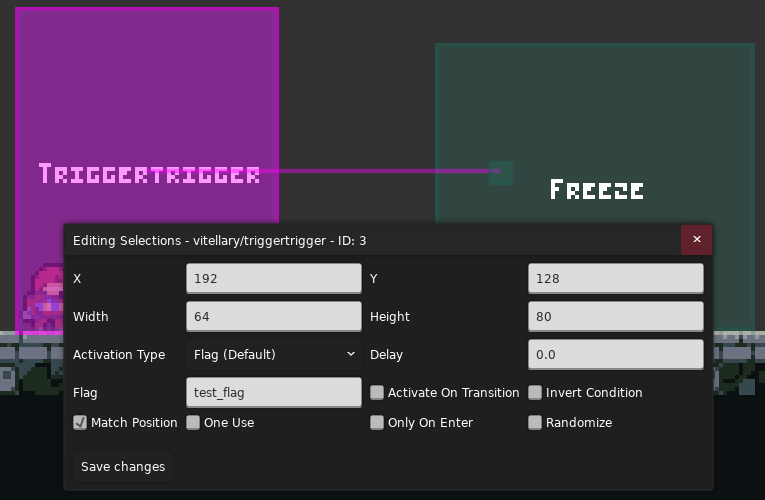

> Myn: 
> 
> 宇宙是如何诞生的？是 tt 触发了那个奇点。
>
> 万物是如何运动的？是 eevee 框动着世界变化。

## 参考

* [Crystalline Helper 文档](https://gamebanana.com/mods/53765){:target="_blank"}
* [Crystalline Helper Github](https://github.com/CommunalHelper/CrystallineHelper){:target="_blank"}
* [Trigger Trigger 简单教程 by Shynnie]()(群文件)

## Trigger Trigger

顾名思义, Trigger Trigger(简称 tt) 就是触发 Trigger 的 Trigger

你可以用它来做这些事情

* 当你要在一个地方叠多层 Trigger 时, tt 能够让你更方便地管理这些 Trigger, 所以你经常能看到有的图只放了一个 tt, 然后连了 很多其他 Trigger 在房间外头(所以 tt 也被戏称为**蜘蛛网**)
* 你可以用 tt 组成一条 tt 链, 搭配 delay 能间隔地触发一些东西
* 因为 tt 可以在玩家做出某种行为时触发, 所以可以做神经 gp, 比如每次跳跃在房间里生成一个新浪
* ...

### 使用

{style="width: 800px; title="123"}

简单来说, 当你的 ActivationType 状态从不满足到满足时, tt 会在 Delay 秒后按顺序触发节点位置的 Trigger(delay 期间不会重复触发)

> ActivationType 在选择某些特殊值时会多出几项属性让你细致的选择监听条件, 比如当你选择 Activation.CoreMod, 则属性栏会多出 CoreMod 这一项(你需要在保存后叉掉面板再打开, 因为 Loenn 不支持实时更新)

然后是剩下的一些属性

* Activate On Transition: 相当于把当前 tt 撑满房间, 进入房间时就已经在 tt 里了, 方便你把 tt 放房间外面而不是挤在房间内
> 说是说房间外, 实际上你可以理解为 tt 从你进入房间开始就一直在无视你的位置监听 ActivationType 的状态
* Invert Condition: 相当于触发条件变成了 not ActivationType, 原来触发的不触发了, 原来不触发的触发了
* Match Position: 相当于把节点处的 Trigger 移到 tt 位置并对齐大小, 就好像这里原来就放着个 Trigger 一样, 因为有些 Trigger 需要用到 Player 的位置, 比如 BloomFadeTrigger, 所以还是得移回到原位
* One Use: 字面意思, 触发一次就失效
* Only On Enter: 在进入 tt 瞬间判断 ActivationType, 而不是呆在 tt 里时判断
* Randomize: 随机触发一个节点处的 Trigger, 而不是按顺序触发节点处的 Trigger

很多时候 tt 主要单纯就是用来整理各种 trigger 的, 在房间外面放一个 flag 模式的 Activate On Transition 的 tt, 连接好要触发的 trigger, 之后在想触发的位置放一个对应的 flag trigger 即可
         

### 细节

Trigger Trigger 会在你进入房间时将节点所在位置的一个 Trigger 纳入它的管理范围, 同时关闭其碰撞, 如果节点盖到两个 Trigger, 先放的先被处理, 如果节点没盖到 Trigger, 则遍历房间找个最近的 Trigger

同时 Trigger Trigger 并不会记录哪个 Trigger 在管理范围内, 所以哪怕你弄两个节点放一个 Trigger 上 或者一个在外面, 一个离得近, 也会触发两次

总之, 保险起见一般都是一个 Trigger 一个节点, 且不留空不用的节点, 不然可能导致某个 Trigger 被多次触发整出奇奇怪怪的问题

### 坑

当你的 ActivationType 为下面三个时, Activate On Transition 会自动打开(一开始科研的时候被坑了, 我还纳闷 Bloom Trigger 怎么生效不了, 结果是生效了但是由于房间太大看着不明显, 虽然当时如果看 Mapping Utils 肯定一眼看出来了())

* ActivationTypes.OnHoldableEnter
* ActivationTypes.OnInteraction
* ActivationTypes.OnEntityEnter
