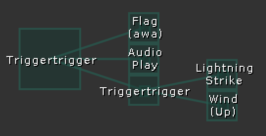
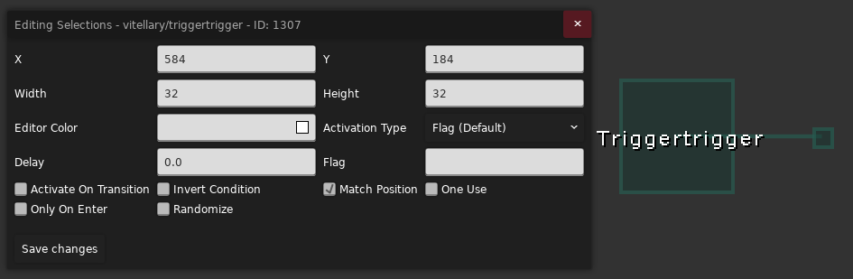
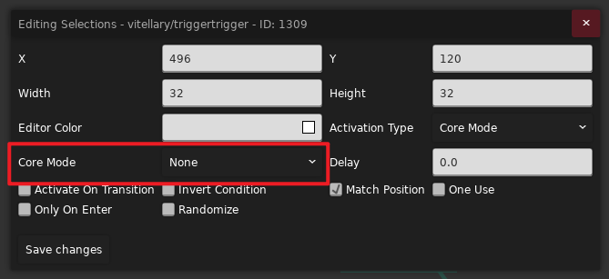
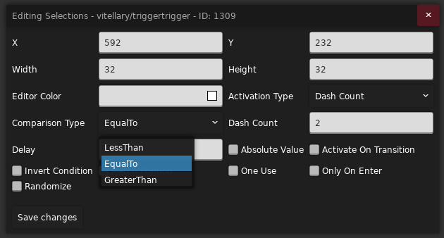
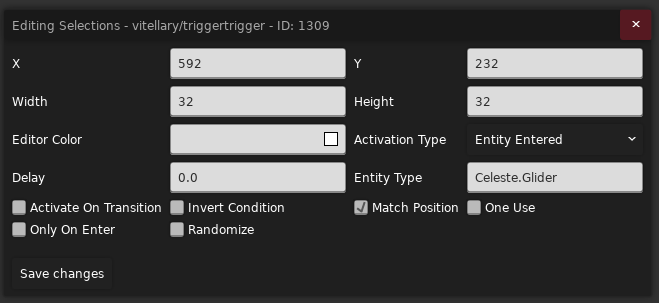

> Myn:
>
> 宇宙是如何诞生的？是 tt 触发了那个奇点
>
> 万物是如何运动的？是 eevee 框动着世界变化

## 参考

* [Crystalline Helper 文档](https://gamebanana.com/mods/53765)
* [Crystalline Helper Github](https://github.com/CommunalHelper/CrystallineHelper)
* [Trigger Trigger 简单教程 by Shynnie](../../assets/mappings/useful_helpers/tt/tt_by_shynnie.docx)
* [常用 Trigger by Breaker-K](https://www.bilibili.com/video/BV1eZW5zVE4t/?&t=2535)

## 介绍

顾名思义, Trigger Trigger (简称 tt)就是触发 Trigger 的 Trigger, 在不改任何配置, 只添加 tt 节点 (按 ++n++)的情况下, 我们已经能实现下面这种最基础的传递结构了

这里我们触碰到 tt 后会按顺序执行

1. 设置一个 `awa` [Flag](../flag/flag.md)
2. 播放一个声音
3. 触发另一个 tt
4. 触发打雷效果
5. 触发向上的风

## 使用

tt 的触发有两种方式

1. 当 `Activation Type` 对应的条件满足时, 你每次进出一次 tt, tt 就会触发一次
2. 若你呆在 tt 内部, 则当 `Activation Type` 从不满足到满足的时候, tt 也会触发一次

### Activation Type

> 注意你在改变 `Activation Type` 后需要重新打开属性面板, 因为 Loenn 不支持实时更新

#### 状态类型

* `Flag (Default)`: 当场上有 `Flag` 或是此项留空 (即默认状态), 条件满足
* `Core`: 当前核心模式与 `Core Mode` 匹配时, 条件满足 
* `Crouching`: 当玩家在蹲着的时候, 条件满足
* `Dashing`: 当玩家在冲刺的时候 (包括冲刺结束后的 `6f Dash Attack Time`), 条件满足
* `Jumping`: 当玩家在跳跃的时候 (包括普通跳跃, 踢墙跳, 不包括 super, hyper 之类的跳跃), 条件满足
* `Jumping`: 当[玩家的状态](../player_state.md)为 `Player State` 时, 条件满足

#### 数值类型

* `Dash Count`: 当玩家当前冲次数和 `Dash Count` 的大小关系与 `Comparison Type` (大于/小于/等于)匹配时, 条件满足
* `Deaths In Level`: 当玩家在当前地图的单局死亡数 (从进入地图到通关, 而不是所有该地图游玩历史的总死亡数)和 `Deaths` 的大小关系与 `Comparison Type` (大于/小于/等于)匹配时, 条件满足
* `Deaths In Room`: 当玩家在当前房间的死亡数和 `Deaths` 的大小关系与 `Comparison Type` 匹配时, 条件满足
* `Horizontal Speed`: 当玩家的水平速度和 `Required Speed` 的大小关系与 `Comparison Type` 匹配时, 条件满足
    - `Absolute Value`: 对于速度这种可能为负数的数值类型, 我们可以通过该选项把比较的双方数字都通过绝对值转化为正数
* `Vertical Speed`: 当玩家的垂直速度和 `Required Speed` 的大小关系与 `Comparison Type` 匹配时, 条件满足
* `On Entity Touch`: 当 [`Entity Type`](../loenn/faq.md#type) 对应的实体被玩家触碰的次数和 `Collide Count` 的大小关系与 `Comparison Type` 匹配时, 条件满足 (注意只有一些特定的实体才能实现这一效果, 比如泡泡, 弹球, 羽毛, 坏德琳球之类的, 其他的你可以自己试试看行不行)
* `Time Since Player Moved`: 当玩家静止不动的时间 (移动后清零计数)和 `Time To Wait` 的大小关系与 `Comparison Type` 匹配时, 条件满足

#### 交互类型

* `Entity Entered`: 当 [`Entity Type`](../loenn/faq.md#type) 对应的实体在 tt 内部时, 条件满足
* `Grounded`: 当玩家处在地面上时, 条件满足
    - `Only If Safe`: 表示玩家是否必须呆在安全地面上, 如果玩家呆在不安全地面上 (比如踩着触发刺), 且勾选了 `Only If Safe`, 条件会不满足
    - `Include Coyote`: 表示是否把玩家拥有狼跳的时间当成是站在地上, 比如刚走下平台的时候
* `Holdable Entered`: 当 tt 内有可抓取物 (Theo 水晶, 水母等)时, 条件满足 (注意当你抓着抓取物的时候该抓取物不会被 tt 算进去)
* `Holdable Grabbed`: 当玩家抓着可抓取物时, 条件满足
* `On Input`: 当玩家按下 `Input Type` 对应按键的瞬间, 条件满足 (如果勾选 `Hold Input` 则表示按着就行)
* `On Interaction`: tt 会生成一个对话交互气泡, 当玩家与其交互时, 条件满足
* `Touched Solid`: 当玩家踩在地上或是抓着砖的时候, 条件满足 (你可以在 `Solid Type` 中填入你需要限定的砖的[类型](../loenn/faq.md#type), 一般是 `SolidTiles`, 但是这个空填了会导致单向板不再被当作地面)

### Activate On Transition

表示忽略玩家的位置, 只检测 `Activation Type` 是否符合条件, 类似于[第二种 tt 触发方式](#trigger_ways) 但是不需要玩家在 tt 内部

常常搭配 `Activation Type` 的 `Flag (Default)` 模式, 这样启用一个 Flag 就能触发 tt 了

#### 坑

当 `Activation Type` 为下面三种类型时, `Activate On Transition` 会自动开启

* `Holdable Entered`
* `On Interaction`
* `Entity Entered`

### Delay

若 `Delay` 大于零, 则 tt 会延迟 `Delay` 秒后触发, 在此期间不会被再次触发

### Match Position

相当于把节点处的 Trigger 移到 tt 位置并对齐大小, 就好像这里原来就放着个 Trigger 一样,
因为有些 Trigger 需要呆在内部才能生效, 比如 `BloomFadeTrigger`, 而 tt 只能做到触发, 所以还是得把这些 Trigger 移回到原位

> 这里 tt 就只起到一个整理的作用, 不用一堆 Trigger 坨在一起

### Randomize

随机触发一个节点处的 Trigger, 而不是按顺序触发节点处的 Trigger

### Only On Enter

表示只能使用上述提到的[第一种 tt 触发方式](#trigger_ways)

### Invert Condition

表示反转 `Activation Type` 的满足条件, 即原来要满足条件 tt 才触发, 现在要不满足条件 tt 才触发

### One Use

字面意思, tt 在触发一次后就失效

## 细节

tt 会在进入房间时, 根据节点的位置寻找对应的 Trigger, 并将其纳入管理范围, 同时关闭该 Trigger 的碰撞

Trigger 的匹配规则如下:

* 如果节点覆盖了多个 Trigger, 则优先处理**放置顺序较早**的 Trigger
* 如果节点没有覆盖任何 Trigger, 则会在房间内寻找**距离节点最近**的 Trigger
* tt 不会记录节点与 Trigger 的对应关系, 因此**多个节点可以匹配到同一个 Trigger**, 导致同一个 Trigger 被重复触发

因此, **一般建议一个 Trigger 对应一个节点, 并避免留下不需要的空节点**, 否则可能因为多个节点匹配到同一个 Trigger, 导致 Trigger 被意外触发多次

## 总结

[Flag](../flag/flag.md) 为你提供了操控实体的方式

Trigger Trigger 为你提供了操控实体的时机

至于接下来该怎么做, 就全靠你的**想象力**了!