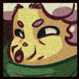

# Portraits.xml

`Portraits.xml` 主要定义了在对话过程中, 我们该如何显示我们的人物表情, 并搭配 [Dialog](../dialog.md) 发出对应的音效, 接下来开始讲解

首先可以看看 `Portraits.xml` 的基本结构, 这里以 Madeline 为例

```xml hl_lines="3 6 21 23"
<?xml version="1.0" encoding="utf-8" ?>
<Sprites>
    <portrait_wiki_granny path="granny/" sfx="wiki_granny" textbox="granny" glitchy="true" BrokemiaHelper_noPortrait="true">
        <Center/>

        <sfxs>
            <normal index="1"/>
            <distracted index="2"/>
            <sad index="3"/>
            <deadpan index="4"/>
            <determined index="5"/>
            <determinedclosed index="5"/>
            <surprised index="6"/>
            <upset index="7"/>
            <angry index="8"/>
            <panic index="9"/>
            <sadder index="10"/>
            <peaceful index="11"/>
        </sfxs>

        <Anim id="idle_normal" path="normal" delay="0.1" frames="0*20" goto="idle_normal:4,idle_normal_blink"/>
        <Anim id="idle_normal_blink" path="normal" delay="0.08" frames="0-1,2*2,3" goto="idle_normal"/>
        <Loop id="talk_normal" path="normal" delay="0.2" frames="4,6,5,0"/>

        <Loop id="idle_peaceful" path="peaceful" delay="0.1" frames="0"/>
        <Loop id="talk_peaceful" path="peaceful" delay="0.2" frames="1,3,2,0"/>

        <Anim id="idle_angry" path="angry" delay="0.1" frames="0*4" goto="idle_angry:5,idle_angry_blink"/>
        <Anim id="idle_angry_blink" path="angry" delay="0.08" frames="0-1,2*2,3" goto="idle_angry"/>
        <Loop id="talk_angry" path="angry" delay="0.2" frames="4,6,5,0"/>

        <Anim id="idle_deadpan" path="deadpan" delay="0.1" frames="0*6" goto="idle_deadpan:5,idle_deadpan_blink"/>
        <Anim id="idle_deadpan_blink" path="deadpan" delay="0.1" frames="0-1,2*2,3" goto="idle_deadpan"/>
        <Loop id="talk_deadpan" path="deadpan" delay="0.2" frames="8,4,5,0"/>

        <Anim id="idle_sleep" path="deadpan" delay="0.1" frames="0,1,2"/>

        <Anim id="idle_sad" path="sad" delay="0.1" frames="0*4" goto="idle_sad:5,idle_sad_blink"/>
        <Anim id="idle_sad_blink" path="sad" delay="0.08" frames="0-1,2*2,3" goto="idle_sad"/>
        <Loop id="talk_sad" path="sad" delay="0.2" frames="4,6,5,0"/>

        <Anim id="idle_sadder" path="sadder" delay="0.1" frames="0*4" goto="idle_sadder:5,idle_sadder_blink"/>
        <Anim id="idle_sadder_blink" path="sadder" delay="0.08" frames="0-1,2*2,3" goto="idle_sadder"/>
        <Loop id="talk_sadder" path="sadder" delay="0.2" frames="4,6,5,0"/>

        <Anim id="idle_upset" path="upset" delay="0.1" frames="0*4" goto="idle_upset:5,idle_upset_blink"/>
        <Anim id="idle_upset_blink" path="upset" delay="0.08" frames="0-1,2*2,3" goto="idle_upset"/>
        <Loop id="talk_upset" path="upset" delay="0.2" frames="4,6,5,0"/>

        <Anim id="idle_surprised" path="surprised" delay="0.1" frames="0*20" goto="idle_surprised:4,idle_surprised_blink"/>
        <Anim id="idle_surprised_blink" path="surprised" delay="0.08" frames="0-1,2*2,3" goto="idle_surprised"/>
        <Loop id="talk_surprised" path="surprised" delay="0.2" frames="4,6,5,0"/>

        <Anim id="idle_distracted" path="distracted" delay="0.1" frames="0*4" goto="idle_distracted:10,idle_distracted_blink1,idle_distracted_blink2"/>
        <Anim id="idle_distracted_blink1" path="distracted" delay="0.08" frames="0-1,2*2,3" goto="idle_distracted"/>
        <Anim id="idle_distracted_blink2" path="distracted" delay="0.08" frames="0,1,2,3,2*2,3" goto="idle_distracted"/>
        <Loop id="talk_distracted" path="distracted" delay="0.2" frames="4,6,5,0"/>

        <Anim id="idle_determined" path="determined" delay="0.1" frames="0*20" goto="idle_determined:4,idle_determined_blink"/>
        <Anim id="idle_determined_blink" path="determined" delay="0.08" frames="0-1,2*2,3" goto="idle_determined"/>
        <Loop id="talk_determined" path="determined" delay="0.2" frames="4,6,5,0"/>

        <Loop id="idle_determinedclosed" path="determined" delay="0.1" frames="7"/>
        <Loop id="talk_determinedclosed" path="determined" delay="0.2" frames="8,10,9,7"/>

        <Anim id="idle_panic" path="panic" delay="0.1" frames="0*20" goto="idle_panic,idle_panic_shake"/>
        <Anim id="idle_panic_shake" path="panic" delay="0.1" frames="0,4,0,4" goto="idle_panic"/>
        <Loop id="talk_panic" path="panic" delay="0.2" frames="1,3,2,0"/>

        <Anim id="idle_together" path="together" delay="0.1" frames="0*20" goto="idle_together:4,idle_together_blink"/>
        <Anim id="idle_together_blink" path="together" delay="0.08" frames="0-1,2*2,3" goto="idle_together"/>
        <Loop id="talk_together" path="together" delay="0.2" frames="4,6,5,0"/>

        <Anim id="begin_togetherZoom" path="togetherZoom" delay="0.06" frames="0-9"/>
        <Anim id="idle_togetherZoom" path="togetherZoom" delay="0.1" frames="10*4" goto="idle_togetherZoom:5,idle_togetherZoom_blink"/>
        <Anim id="idle_togetherZoom_blink" path="togetherZoom" delay="0.08" frames="10,14,15*2,16" goto="idle_togetherZoom"/>
        <Loop id="talk_togetherZoom" path="togetherZoom" delay="0.2" frames="11,13,12,10"/>

        <!--<Anim id="idle_cry" path="cry" delay="0.1" frames="0" goto="idle_cry"/>
        <Loop id="talk_cry" path="cry" delay="0.2" frames="0" />-->
    </portrait_madeline>
</Sprites>
```

## portrait_madeline

比如我们平时在 Dialog 中调出对应表情的方式是 `[人物名 情绪名]`, 游戏就是通过这个人物名(忽略大小写)加上前缀 `portrait_`, 来找到上方的 `portrait_madeline`, 所以游戏知道你要用什么动画

### path

我们要指定动画素材对应的路径, 路径从 `Graphics/Atlases/Portraits/` 开始算, 比如这里的 `madeline/`

### [sfx](../audio/audio.md#speak)

填入我们自定义的人物音频对应的 event 路径(从 `event:/char/dialouge/` 开始), 比如这里游戏就是通过 `madeline` 找到 fmod 中的
`event:/char/dialouge/madeline`

### textbox

填入我们自定义的对话框贴图路径(从 `Graphics/Atlases/Portraits/textbox/` 开始), 比如这里游戏就是通过 `madeline` 找到 `Graphics/Atlases/Portraits/textbox/madeline.png` 的

### glitchy

如果开启了这个选项, 那么游戏会给人物头像加上一层老旧电视那样沙沙的 glitch 特效

{style="width: 100px; title="123"}

### BrokemiaHelper_noPortrait

开启 `BrokemiaHelper` 后, 添加此选项可以让人物角色不显示头像, 这在[烈冕号的牌子](https://www.bilibili.com/video/BV1Lx4y1F7wy/?t=543)中用到了

### [sfxs](../audio/audio.md#speak)

```xml

<sfxs>
    <normal index="1"/>
    <distracted index="2"/>
    <sad index="3"/>
    <deadpan index="4"/>
    <determined index="5"/>
    <determinedclosed index="5"/>
    <surprised index="6"/>
    <upset index="7"/>
    <angry index="8"/>
    <panic index="9"/>
    <sadder index="10"/>
    <peaceful index="11"/>
</sfxs>
```

游戏会通过上面提到的情绪名在这里找到应该使用的声音索引, 具体原理参考上方链接, 大部分时候我们只是改, 而不用自己加, 所以这块不用理解的很清楚

### Animations

> 至于如何配置动画可以参考 [Sprites.xml 栏目](./sprites_xml.md)

游戏会通过上面提到的情绪名来找到对应的的动画, 不过游戏会自动为其加入各种前缀, 比如 `begin_`, `talk_`, `idle_`

比如当你使用 `[madeline normal]` 时, 游戏会先播放 `portrait_madeline` 中的 `begin_normal`, 说话的时候则播放 `talk_normal`, 其他情况播放 `idle_normal`, 


