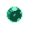
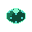
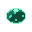
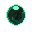
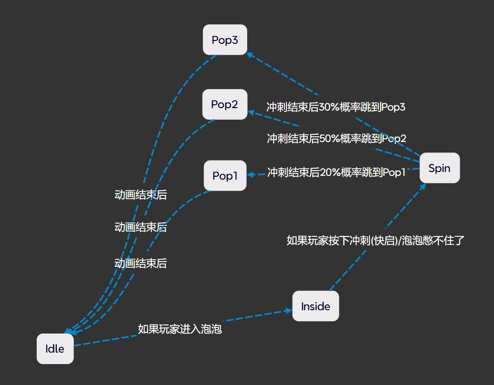
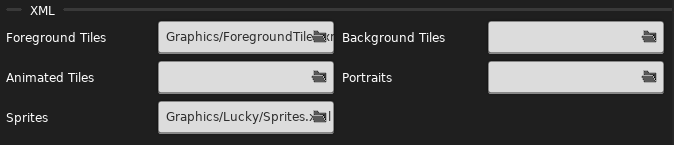

# Sprites.xml

你可能需要先了解一下什么是[XML](xml.md)

## 动画

我们在讲 `Sprites.xml` 之前先简单介绍下什么是动画

简单来说就是利用人类的视觉残留现象通过连续的相近的画面给人一种 "动" 的感觉, 比较贴近现实的是[翻页动画](https://search.bilibili.com/all?vt=16694194&keyword=%E7%BF%BB%E9%A1%B5%E5%8A%A8%E7%94%BB)

但是在计算机动画中比较常见的是 `帧动画` 和 `骨骼动画`

### 帧动画

连续播放一张张图片(蔚蓝使用 `.png` 格式的图片)

这是 5 张 绿泡泡`Booster` 的 闲置`idle` 图片

{style="width: 150px; image-rendering: pixelated; title="123"}
{style="width: 150px; image-rendering: pixelated; title="123"}
{style="width: 150px; image-rendering: pixelated; title="123"}
{style="width: 150px; image-rendering: pixelated; title="123"}
{style="width: 150px; image-rendering: pixelated; title="123"}

如果按一定时间间隔连续播放, 我们就得到了一张生动的动画(这里我们播放完一次会再播放一次, 这被称为 `loop`)

一张图片在动画中被称为**一帧** 

{style="width: 150px; image-rendering: pixelated; title=123"}

### 骨骼动画

由于蔚蓝里几乎全是帧动画(当然还有程序生成的动画, 比如 9a 的黑洞, 就是通过拉伸, 旋转, 平移改变各种贴图的颜色实现的), 所以这里就简单聊一下骨骼动画

我们将一张图片分解成若干网格, 再用"骨骼"来控制一部分网格, 这样当我们旋转骨骼的时候, 网格也会跟着形变, 这样我们就可以用一张图片来做动画了

具体可以看看[相关视频](https://www.bilibili.com/video/BV1kK4y1t79f/?vd_source=88291083a8b9233d0006bb44b0331137&t=135)

## 动画状态机

如果我们有了一堆图片, 我们就可以制作各种各样的动画, 但是该怎么管理他们呢

### 分组

显然我们可以根据状态/逻辑来划分动画, 这样便于动画衔接, 管理和制作, 比如上面的绿泡泡`Booster`会有四种状态

#### 闲置状态(`idle`)

绿泡泡在正常情况下的样子

{style="width: 150px; image-rendering: pixelated; title=123"}

#### 玩家刚进绿泡泡时的状态(`inside`)

在写这个引导之前我从来没有注意过绿泡泡里面有个Madline😱

{style="width: 150px; image-rendering: pixelated; title=123"}

#### 玩家在绿泡泡里冲刺时的状态(`spin`)

{style="width: 150px; image-rendering: pixelated; title=123"}

#### 玩家冲刺结束, 绿泡泡爆炸时的状态(`pop`)

{style="width: 150px; image-rendering: pixelated; title=123"}


### 跳转

比如我们在泡泡快启/不快启的时候泡泡动画得马上/等待一会儿从 `inside` 状态中断然后跳转到 `spin` 状态

#### 随机性

虽然动画相比于图片已经生动许多, 但是如果泡泡每次爆炸的动画都长一样, 那看多了难免也会觉得生硬, 所以我们可以定义多个 `pop` 动画, 这样在切换动画的时候随机选择一个 `pop` 动画即可

如果我们把一个分组的动画看作一个节点, 把动画跳转所需的条件来连接各个节点, 则我们可以清晰的看出绿泡泡各动画之间的关联, 这被称作...`动画状态机`!

{style="width: 800px;}


## Sprites.xml

 `Sprites.xml`是蔚蓝用来配置动画和动画状态机的配置文件

接下来搭配 `Booster` 的 `Sprites.xml` 和文件路径简单讲解下节点和属性的含义

```xml title="Celeste/Content/Graphics/Sprites.xml" hl_lines="5 6 7 10 15 24"
<?xml version="1.0" encoding="utf-8" ?>
<Sprites>
    <!-- 前面的一些配置... -->
    
    <booster path="objects/booster/" start="loop">
        <Justify x="0.5" y="0.5"/>
        <Loop id="loop" path="booster" delay="0.1" frames="0-4"/>
        <Loop id="inside" path="booster" delay="0.1" frames="5-8"/>
        <Loop id="spin" path="booster" delay="0.06" frames="18-25"/>
        <Anim id="pop" path="booster" delay="0.08" frames="9-17"/>
    </booster>
    
    <boosterRed path="objects/booster/" start="loop">
        <Justify x="0.5" y="0.5"/>
        <Anim id="appear" path="boosterRed" delay="0.08" frames="26-34" goto="loop"/>
        <Loop id="loop" path="boosterRed" delay="0.1" frames="0-4"/>
        <Loop id="inside" path="boosterRed" delay="0.1" frames="5-8"/>
        <Loop id="spin" path="boosterRed" delay="0.06" frames="18-25"/>
        <Anim id="pop" path="boosterRed" delay="0.08" frames="9-17"/>
    </boosterRed>
    
    <badelineBoost path="objects/badelineBoost/" start="idle">
        <Justify x="0.5" y="0.5"/>
        <Anim id="idle" path="idle" frames="0-5" delay="0.08" goto="idle:10,flash:2,blink"/>
        <Anim id="flash" path="idle" frames="6-11" delay="0.08" goto="idle"/>
        <Anim id="blink" path="idle" frames="12-25" delay="0.08" goto="idle"/>
    </badelineBoost>
    <!-- 后面的一些配置... -->
</Sprites>
```

* 📁Graphics
    * 📁Atlases 
        * 📁Gameplay
            * 📁objects
                * 📁booster
                    * 🟢booster00
                    * 🟢booster01
                    * 🟢 ...
                    * 🟢booster25

* &lt;xxx&gt; ... &lt;/xxx&gt;: 这里 xxx 表明了一个对象 id, 比如这里是 booster, 标签内部包含了对象的各种动画分组和配置,
  游戏会根据标签生成一个动画对象, 所以对于有的换肤实体可能会让你填动画对象的 id, 而不是素材文件路径
    * path: 素材文件夹路径, 相对于 `Gameplay` 文件夹
    * start: 开始动画对应的 id
    * &lt;Justify/&gt;: 锚点位置, 或者说图片中心在哪儿, 一张图片放在某个位置, 光有坐标还不够(一个面上会有无穷个点), 还得有图片的中心, 也就是图片上的哪个点该放在那个位置(范围`0 ~ 1`)
    * &lt;Loop/&gt;: 循环动画, 播放这个动画会自动循环
    * &lt;Anim/&gt;: 普通动画, 播放结束后停止
        * id: 动画 id,
        * path: 动画素材相对于素材文件夹路径的路径
        * delay: 动画一帧的持续时间
        * frames: 指定哪些帧来组成动画(动画命名规则一般是`booster00``booster01` ... `boosterXX`, 你看一眼官图素材就全懂了)
            * 显式指定: `0 1 2 3 4` 表示从第 0 帧到第 4 帧
            * 指定范围: `0-4` 表示从第 0 帧到第 4 帧
        * goto: 播放完动画后跳到哪个动画, 如果写了多个 id, 则可以写上数字表示对应跳转的概率有多大, 如下面的 `badelineBoost` 的 `goto="idle:10,flash:2,blink` (你可能会注意到 `booster` 并没有 `goto`, 因为上面的例子是我编的, 只是方便理解而已^_^)


## 自定义 `Sprites.xml`

1. 把官图的 `Sprites.xml` 粘过来放自己 Mod 里(路径`Celeste/Content/Graphics/Sprites.xml`)
2. 记得改名或者套文件夹(如果你不知道这意味着什么, 请看[这里](../mod_structure.md#everest))
3. 之后就可以开始修改官图配置或者额外写自己的配置
4. 最后在 Loenn 元数据中选择自己的 `Sprites.xml` 即可
   

