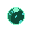
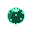
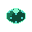
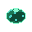
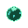
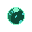
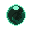
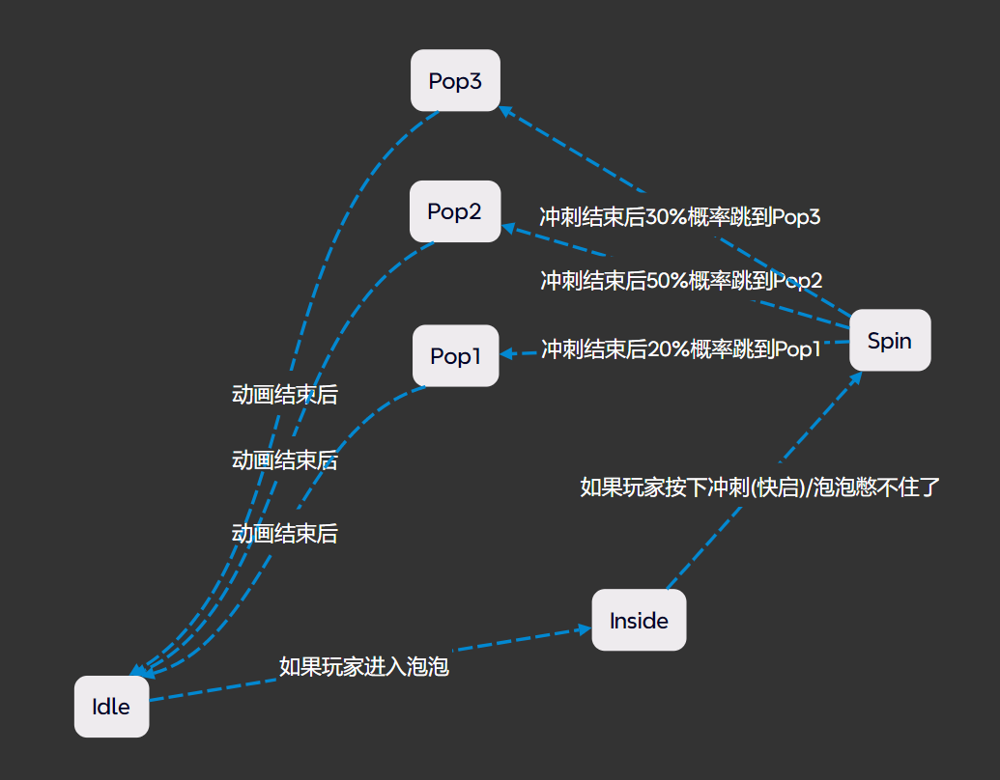

# Sprites.xml

你可能需要先了解一下什么是[XML](xml.md)

## 动画

我们在讲 `Sprites.xml` 之前先简单介绍下什么是动画

简单来说就是利用人类的视觉残留现象通过连续的相近的画面给人一种 "动" 的感觉,
比较贴近现实的是[翻页动画](https://search.bilibili.com/all?vt=16694194&keyword=%E7%BF%BB%E9%A1%B5%E5%8A%A8%E7%94%BB)

但是在计算机动画中比较常见的是 `帧动画` 和 `骨骼动画`

### 帧动画

连续播放一张张图片(蔚蓝使用 `.png` 格式的图片)

这是 5 张 绿泡泡 `Booster` 的闲置 `idle` 图片

{style="width: 150px; image-rendering: pixelated; title="123"}
{style="width: 150px; image-rendering: pixelated; title="123"}
{style="width: 150px; image-rendering: pixelated; title="123"}
{style="width: 150px; image-rendering: pixelated; title="123"}
{style="width: 150px; image-rendering: pixelated; title="123"}

如果按一定时间间隔连续播放, 我们就得到了一张生动的动画(这里我们播放完一次后会再次从头循环播放, 这被称为 `loop`)

{style="width: 150px; image-rendering: pixelated; title=123"}


<div class="admonition tip">
    <p class="admonition-title">Tips</p>
    <p>一张图片在动画中被称为<strong>一帧</strong>, 所以这样的动画也叫<strong>帧动画</strong></p>
</div>

### 骨骼动画

由于蔚蓝里几乎全是帧动画, 所以这里的骨骼动画就简单提一嘴

> 当然蔚蓝里还有程序生成的动画, 比如 9a 的黑洞, 就是通过拉伸, 旋转, 平移的同时改变各种贴图的颜色来实现的 

我们将一张图片分解成若干网格, 再用**骨骼**来控制一部分网格, 这样当我们旋转骨骼的时候, 网格也会跟着形变, 
这样我们就可以用很少的图片素材来做动画了, 具体可以看看[相关视频](https://www.bilibili.com/video/BV1kK4y1t79f/?vd_source=88291083a8b9233d0006bb44b0331137&t=135)

## 动画状态机

如果我们有了一堆图片, 我们就可以制作各种各样的动画, 但是该怎么管理他们呢

### 分组

显然我们可以根据状态/逻辑来划分动画, 这样便于动画衔接, 管理和制作, 比如上面的绿泡泡 `Booster` 会有四种状态

#### 闲置状态(`idle`)

绿泡泡在正常情况下的样子

{style="width: 150px; image-rendering: pixelated; title=123"}

#### 玩家刚进绿泡泡时的状态(`inside`)

> 在写这个引导之前我从来没有注意过绿泡泡里面有个Madeline😱

{style="width: 150px; image-rendering: pixelated; title=123"}

#### 玩家在绿泡泡里冲刺时的状态(`spin`)

{style="width: 150px; image-rendering: pixelated; title=123"}

#### 玩家冲刺结束, 绿泡泡爆炸时的状态(`pop`)

{style="width: 150px; image-rendering: pixelated; title=123"}

### 跳转

比如我们在泡泡快启/不快启的时候泡泡动画需要马上/等待一会儿从 `inside` 状态中断然后跳转到 `spin` 状态,
同时 `pop` 状态也不可能直接跳转到 `spin 状态`

所以动画分组之间需要有跳转逻辑, 不可能漫无目的地随便跳转


#### 随机性

虽然动画相比于图片已经生动许多, 但是如果泡泡每次爆炸的动画都长一样, 那看多了难免也会觉得生硬, 
所以一种解决方案是我们可以定义多个 `pop` 动画, 这样在切换动画的时候随机选择一个 `pop` 动画即可

如果我们把一个分组的动画看作一个节点, 把动画跳转所需的条件来连接各个节点, 则我们可以清晰的看出绿泡泡各动画之间的关联, 这被称作 ... **动画状态机**!

{style="width: 800px;}

<a id="xml"></a>

## Sprites.xml

`Sprites.xml` 是蔚蓝用来配置动画和动画状态机的配置文件

接下来搭配 `Booster` 的 `Sprites.xml` 和文件路径简单讲解下节点和属性的含义

<div class="admonition note">
    <p class="admonition-title">注意</p>
    <p>不要因为属性多就感到害怕, 绝大多数情况我们只是把官图的配置尻过来改个 <code>id</code> 改个 <code>path</code> 即可, 
        这里只是为了让你了解它的结构和含义, 以便你更好的理解, 或是有需要的时候能更好地自定义自己的动画
    </p>
</div>

    

```xml title="Celeste/Content/Graphics/Sprites.xml" hl_lines="5 6 7 10 15 24"
<?xml version="1.0" encoding="utf-8" ?>
<Sprites>
    <!-- 前面的一些配置... -->

    <booster path="objects/booster/" start="loop">
        <Justify x="0.5" y="0.5"/>
        <Loop id="loop" path="booster" delay="0.1" frames="0-4"/>
        <Loop id="inside" path="booster" delay="0.1" frames="5-8"/>
        <Loop id="spin" path="booster" delay="0.06" frames="18-25"/>
        <Anim id="pop" path="booster" delay="0.08" frames="9-17"/>
    </booster>

    <boosterRed path="objects/booster/" start="loop">
        <Justify x="0.5" y="0.5"/>
        <Anim id="appear" path="boosterRed" delay="0.08" frames="26-34" goto="loop"/>
        <Loop id="loop" path="boosterRed" delay="0.1" frames="0-4"/>
        <Loop id="inside" path="boosterRed" delay="0.1" frames="5-8"/>
        <Loop id="spin" path="boosterRed" delay="0.06" frames="18-25"/>
        <Anim id="pop" path="boosterRed" delay="0.08" frames="9-17"/>
    </boosterRed>

    <badelineBoost path="objects/badelineBoost/" start="idle">
        <Justify x="0.5" y="0.5"/>
        <Anim id="idle" path="idle" frames="0-5" delay="0.08" goto="idle:10,flash:2,blink"/>
        <Anim id="flash" path="idle" frames="6-11" delay="0.08" goto="idle"/>
        <Anim id="blink" path="idle" frames="12-25" delay="0.08" goto="idle"/>
    </badelineBoost>
    <!-- 后面的一些配置... -->
</Sprites>
```

* 📁Graphics
    * 📁Atlases
        * 📁Gameplay
            * 📁objects
                * 📁booster
                    * 🟢booster00
                    * 🟢booster01
                    * 🟢 ...
                    * 🟢booster25

### 动画对象

`<xxx></xxx>` 声明了一个叫 `xxx` 的 XML 动画对象节点, 名字唯一, 比如上面的这个 `booster`

标签内部包含了跟这个动画对象节点有关的的各种动画配置节点, 比如上面提到的分组, 跳转等配置,
最后游戏会根据标签生成一个实实在在的动画对象

接下来讲解动画对象的基本属性:

* `path`: 素材文件夹的相对路径(相对于 `Gameplay` 文件夹), 游戏会通过 `path` 找到你的动画素材存在了哪个文件夹
* `start`: 开始动画对应的 `id`, 后续会为每个动画分组分配一个 `id`, 你可以通过设置 `start` 表明要从哪个动画分组开始播放

#### 基本动画配置

* `<Anim/>`: 普通动画, 需要自己配置细节部分, 播放结束后停止
    * `id`: 动画 `id`, 对应上面的动画分组概念, 游戏会使用这个 `id` 来找到你的动画分组
    * `path`: 动画素材相对于素材文件夹路径的路径, 游戏将两个 `path` 拼接起来来找到具体的图片素材是哪个, 比如 `objects/booster/ + booster -> objects/booster/booster.png`
    * `delay`: 动画一帧的持续时间
    * `frames`: 指定哪些帧来组成动画(动画命名规则一般是 `booster00`, `booster01`, `...`, `boosterXX`, 表示帧的顺序, 从 0 开始)
        * 显式指定: `0,1,2,3,4` 表示从第 0 帧到第 4 帧
        * 指定范围: `0-4` 表示从第 0 帧到第 4 帧
        * 重复指定: `3*4` 表示 4 个第 3 帧, 约等于 `3,3,3,3`
    * `goto`: 播放完当前动画分组后跳到哪个动画分组, 如果写了多个 `id`, 则会随机挑选一个跳转, 你可以写上数字(不填默认占 1 份)表示对应跳转的相对概率有多大, 如下面的 `badelineBoost` 的 `goto="idle:10,flash:2,blink`, 跳转到 `idle` 的概率为 `10/13`
* `<Loop/>`: 循环动画, 播放这个动画会自动从头开始循环, 约等于 `<Anim/>` 的 `goto` 指向自己
* `<Justify x="" y=""/>`: 锚点的相对位置, `x`, `y` 的范围为 `0 ~ 1`, 对应 `0 ~ 100%`

<div class="admonition tip">
    <p class="admonition-title">锚点</p>
    <p>如果大家不理解锚点的意思, 这里作一个简单的解释:</p>
    <p>想象一下如果让你把图片放在 <code>(114, 514)</code> 坐标对应的位置, 你会怎么放, 你会把图片的左上角放在这个位置呢,
    还是把图片的中心放在这个位置呢, 又或是其他图片部位? 所以你会发现如果没有没有一个支点我们根本不知道怎么放置图片, 
    所以锚点就是用来解决这个问题的, 你可以用锚点定义这个图片的支点在身上的哪个部位, 之后游戏抓着支点连带图片挪到对应位置就好了
    </p>
    <p>
    一种简单的理解方式是: 锚点就是纸上的图钉, 你先把图钉插纸上, 然后再找个位置插墙上 
    </p>
</div>


### `<Metadata></Metadata>`

```xml hl_lines="7 15 18"

<Sprites>
    <player path="characters/player/" start="idle">
        <Anim id="idle" path="idle" delay="0.1" goto="idle"/>
        <Anim id="idleA" path="idleA" delay="0.12" goto="idle"/>
        <Anim id="idleB" path="idleB" delay="0.16" goto="idle"/>
        <Anim id="idleC" path="idleC" delay="0.05" goto="idle"/>
        <Metadata>
            <!-- path: 表示当前标签作用的对应的动画的 id -->
            <Frames path="idle" hair="0,-2|0,-2|0,-2|0,-2|0,-1|0,-1|0,-1|0,-1|0,-1"/>
            <Frames path="idleA" hair="0,-2|-1,-2:1|-1,-2:2|-1,-2:2|-1,-2:2|-1,-1:2|-1,-1:2|-1,-1:2|-1,-1:1|-1,-1:1|-1,-1|0,-1|0,-1"/>
            <Frames path="idleB"
                    hair="0,-2|-1,-2|-1,-2|-1,-2|-1,-2|-1,-2|-1,-2|-1,-2|-1,-2:1|-1,-2:2|-1,-2:2|-1,-2:2|-1,-2:2|-1,-2:1|-1,-2|-1,-2|-1,-2|0,-2|0,-2|0,-1|0,-1|0,-1|0,-1|0,-1"/>
            <Frames path="idleC" hair="0,-2|-1,-2|-2,-2|-2,-2|-2,-2|-2,-2|1,-1|2,0|0,0|-1,-1|0,-1|0,-1"/>
            ...
            <Frames path="idle_carry" hair="0,-2|0,-2|0,-2|0,-2|0,-1|0,-1|0,-1|0,-1|0,-1" carry="-1,-1,-1,0,0,0,0,0,-1"/>
            <Frames path="jump_carry" hair="1,-3|1,-3|1,-2|0,-2" carry="-3,-3,-1,-1"/>
            <Frames path="run_carry" hair="1,-2|1,-1|1,-1|1,-1|1,-3|1,-2|1,-1|1,-1|1,-1|1,-1|1,-3|1,-2" carry="-1,0,0,0,-3,-2,-1,0,0,0,-3,-1"/>
            <Frames path="fallPose" hair="x|x|x|x|x|x|x|x|x"/>
        </Metadata>
    </player>
</Sprites>
```


`<Metadata></Metadata>` 是 `Sprites.xml` 中 `player` 动画配置内部的特殊节点,
内部包含了一系列 `<Frames></Frames>` 节点, 
这些 `<Frames></Frames>` 节点会为对应动画的某一帧附上一些额外**信息**, 以供游戏内使用, 这里讲解两个比较重要的属性

<a id="hair"></a>

#### hair

首先你可以简单了解下蔚蓝的头发是怎么绘制的, 这里举一个相近的[例子](https://www.bilibili.com/video/BV1dy421v7o1), 
蔚蓝差不多就是这么做的, 但是会在这个基础上加个刘海, 这里的刘海相当于上面例子中的头节点, 其他部分就是一个个圆形

<figure style="display: flex; gap: 1rem;">
  <div>
       
    <figcaption>路径: Gameplay/characters/player/bangs00.png</figcaption>
  </div>
  <div>
       
    <figcaption>路径: Gameplay/characters/player/hair00.png</figcaption>
  </div>
</figure>

你会发现因为头发是代码绘制的, 所以游戏素材中的人物贴图似乎都是不带头发的, 所以游戏需要通过某种方式将头发和身体联系起来,
~~不然头发怎么知道自己该安在哪里(摸不着头脑)~~, 这就是 `hair` 属性的作用


然后我们开始介绍 `hair` 属性, 以 `idle` 动画为例, 它所携带的信息为

`<Frames path="idle" hair="0,-2|0,-2|0,-2|0,-2|0,-1|0,-1|0,-1|0,-1|0,-1"/>`

我们可以发现, `hair` 的格式类似于 `a,b|c,d|...|g,h|`, 它被 `|` 分隔成一个个组, 每个组对应了动画的一帧, 按顺序排列, 比如 `idle` 动画占 8 帧, 所以它对应的配置有 8 组

每个组有两个数, 被 `,` 分隔, 表示刘海相对于 Madeline 头顶的某个位置的 x/y 偏移, 由于官方已经提前调好刘海的大概位置了, 所以你只需要微调 x/y 即可(这也是为什么这些数字都很小的原因)

有些分组形如 `a,b:c`, 这里的 `c` 范围为`0~2`(不填默认为 `0`), 表示 Madeline 的刘海朝向(具体看`player`素材里的`bangs00` `bangs01` `bangs02`), 比如像 `idleA` 动画中的 Madeline
会左看看右看看, 这就得修改刘海的朝向

<div class="admonition note">
    <p class="admonition-title">注意</p>
    <p>如果 <code>hair</code> 选项缺失或者对应组填入符号 <code>x</code>, 则表示这一帧人物动画代码不会绘制头发, 常用在非代码控制的动画上, 比如上方的 <code>fallPose</code> 动画就是纯手绘头发而不是代码控制</p>
</div>


<a id="carry"></a>

#### carry

如果你仔细观察过你会发现人物抓取抓取物 (如 `Theo Crystal`)的时候, 抓取物会随着动画一上一下, 我们需要通过 `carry` 属性将这个信息传递给游戏

以 `idle_carry` 动画为例, 它所携带的信息为 

`<Frames path="idle_carry" hair="0,-2|0,-2|0,-2|0,-2|0,-1|0,-1|0,-1|0,-1|0,-1" carry="-1,-1,-1,0,0,0,0,0,-1"/>`

`carry` 的格式类似于 `a,b,c,d,...,l,m,n`, 它被 `,` 分隔成一个个组, 每个组对应了动画的一帧, 表示对应帧抓取物 y 方向的相对偏移

#### Prevent Skin-Mod Gameplay Changes

因为更改 `carry` 会影响游戏的运行机制, 比如改矮了抓取物被扔到最高点的时候可能会碰不到硬币, 所以就有了 Celeste TAS 中的这个选项设置, 可以强制皮肤使用原版特性

## 自定义 `Sprites.xml`

> 官图 `Sprites.xml` 路径: `Celeste/Content/Graphics/Sprites.xml`

1. 把官图的 `Sprites.xml` 粘过来放自己 Mod 里, 记得[套文件夹](../mod_structure.md#everest)
2. 之后就可以开始修改官图配置或者额外写自己的配置
3. 最后在 Loenn 元数据中选择配置自己的 `Sprites.xml` 即可
   

