# 自定义瓦片(Tileset)

你可能需要先了解一下什么是[XML](xml.md)

* [摘自电箱教程](https://www.bilibili.com/video/BV1kV4y137Mn/?spm_id_from=333.788&vd_source=217bacbee37820b5bf3ed2f4fb8f6c94)
* [摘自Everest Wiki](https://github.com/EverestAPI/Resources/wiki/Custom-Tilesets)
* [瓦片集格式参考](https://github.com/EverestAPI/Resources/wiki/Tileset-Format-Reference)
* [motonine的自制tiles教程](../../assets/mappings/xml/tileset/自制tiles教程%5B23.12.17更新%20作者motonine%5D.txt)
* [底龙的自定义tiles教程](https://www.bilibili.com/video/BV1Eu4y1L78Y), [非官方模板的tiles应用](https://www.bilibili.com/video/BV1t94y1c7ZT)

## Tile

Tile, 即**瓦片**

想想我们在贴地面瓷砖或是在房顶摆瓦片的时候, 操作是不是就像在 Loenn 里拿着砖在那儿涂涂画画呢

### 热知识

我们在 Loenn 里涂的砖是永远不会被卸载的, 也就是不存在进房间的时候加载对应区域的砖, 离开房间的时候卸载, 所以像 Filler 这种进不去的房间, 里面的砖也会在我们切板的时候被看到

## Tileset

Tileset, 即 Tile set, **瓦片集**

表示各种瓦片的集合, 就像我们在 Loenn 里涂砖的时候, 不可能所有的砖都一个样, 每个砖的样式会随着周围砖的摆放和清除而变化

Tileset 分为前景砖和背景砖, 这里我们主要讨论前景砖 

我们游戏中的砖主要由一块块 `8px * 8px` 大小的碰撞箱和贴图组成(后文将其称为一个**单元**)


<figure markdown>
  {style="width: 150px; image-rendering: pixelated; title=123"}
  <figcaption>路径: Celeste\Graphics\Atlases\Gameplay\tilesets\cement.png</figcaption>
</figure>

我们以 cement tileset 为例, 我们会发现它正是由一个个 `8px * 8px` 单元的贴图块组成, 游戏里的砖的贴图正是从这里面**切**出来的

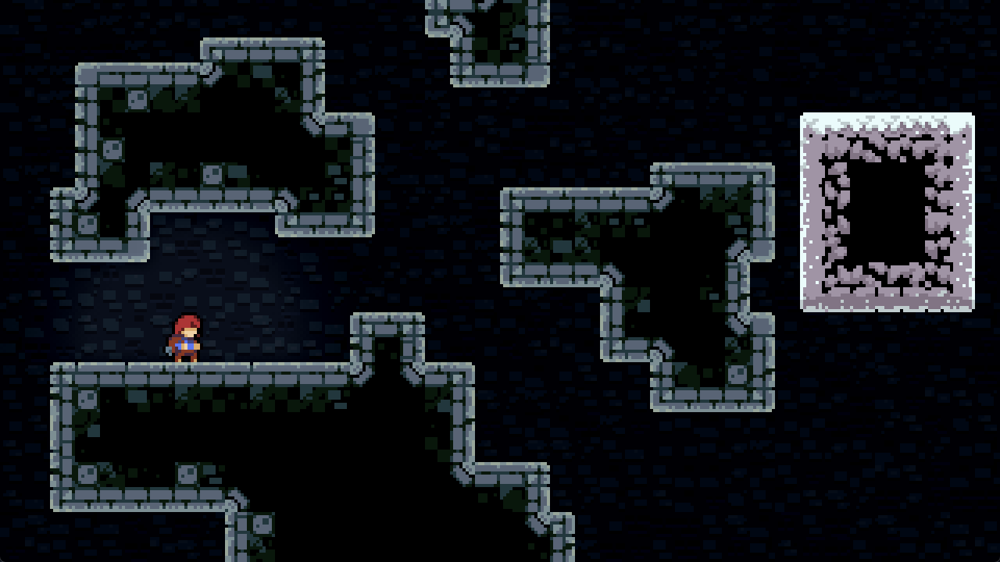
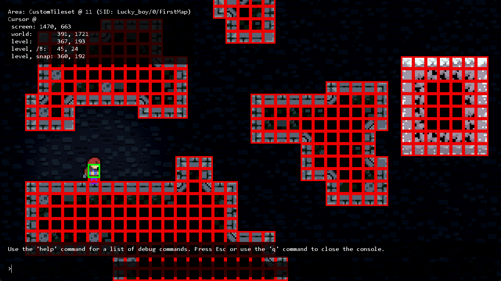

当然如果我们把 CelesteTAS 的简化图形看开了, 碰撞箱看的更清楚

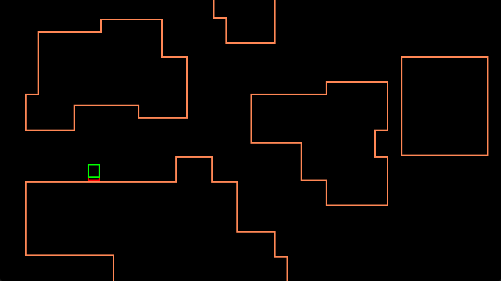


## ForegroundTiles.xml

现在我们搞清楚了砖是什么, 素材从哪儿来, 现在该开始摆砖了, 但你可能开始头疼起来, 这么一种砖就有这么多个单元, 要一个个选吗, 不仅费事, 还容易选错,
所以这时我们就要指定一套**规则**, 比如看下面这个 `3px * 3px` 大小的自定义砖

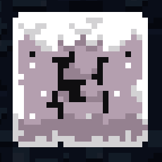{style="width: 150px; image-rendering: pixelated; title=123"}

* 如果我告诉中间的砖: 嘿, 兄弟, 你要是看见周围都有砖的话, 你就把自己的的贴图改成素材第 i 行, 第 j 列单元对应的素材
* 如果我告诉正右边的砖: 兄弟...你好..., 你要是看见上下都有砖, 而且左边也有砖的话, 你就把自己的的贴图改成素材第 m 行, 第 n 列单元对应的素材

如果我们把所有的砖通知一遍, 那是不是就不用我们自己一个个挑素材啦, 而这正是 `ForegroundTiles.xml` 和 Loenn(Celeste 也干了) 在做的事, `ForegroundTiles.xml` 制定了一套规则, 而 Loenn 使用这些规则告诉每个砖该如何绘制(所以如果我们要做自定义砖的话, 我们要自己写`ForegroundTiles.xml`, 而且得在 Loenn 元数据里选)


### ForegroundTiles.xml 属性
下面我们来简单介绍一下`ForegroundTiles.xml` 中相对重要的属性

更多属性请参考[Everest Wiki](https://github.com/EverestAPI/Resources/wiki/Tileset-Format-Reference)

* `id`: 嗯...就是类似身份证一样的东西, 唯一标识符, 对...你懂的吧...就..就是 id 啊...嗯...比如类比下你叫张三, 你的学号是 114, 那么你的 id 就是 114... id 不能重复你应该知道的吧...
* `path`: 指明了 tileset 对应的素材位置, 路径相对于`Gameplay/tilesets` 文件夹, 例如上面提到的 `cement` 对应的 `path` 就是 `cement` 
* `mask`: 也就是上文提到的**规则**, 表示对应位置砖周围的情况, 去掉 `-` 分三行排列刚好是个 `3 x 3` 的块, 块中间的位置对应当前砖的位置, 然后我们需要在这个九宫格内填规则, `0` 表示无砖, `1` 表示有砖, `x` 表示任意, 因为九宫格的中间对应当前砖, 所以永远填 `1`, 如果不写规则直接填`padding`则表示最外层的里面一层(例如对于`4 x 4`的块, 它的`padding`在`3 x 3`位置), 如果不写规则直接填`center`, 则表示剩下的没有被考虑的所有情况(一般来说就是指比`padding`还要里面的), 一个单元就是通过这样的规则来判断自己要选择什么贴图的  
* `tiles`: 对应素材的哪些单元(一个单元占`8px * 8px`的大小并且坐标从左上(0, 0)位置开始算, (1, 0)表示第二列第一行对应的单元格, 是的没错, 从列开始算!)  
* `ignores`: 需要忽略的 tileset 对应的 id, 被忽略后, 周围要是有那个 tileset, 则那个位置在当前 tileset 的 mask 中会被视为空气, 即 `0(无砖)` 
* `copy`: 需要拷贝配置(即内部的`set`节点)的 tileset 对应的 id, 这样我们就可以只写一个 template(模板) 然后复用了, 当然我们可以继续写`set`节点来覆盖拷贝过来的一部分配置  
* `sound`: Everest 添加的额外配置, 表示玩家踩上去什么声音, 写在`set`节点里, 如`<set ... sound="1"/>`, 具体数字对应的声音可以看[对照表](./tile_sounds.md)


```xml title="Celeste\Content\Graphics\ForegroundTiles.xml"
<Data>
  <Tileset id="z" path="template">
    <set mask="x0x-111-x1x" tiles="0,0;1,0;2,0;3,0"/>
    <set mask="x1x-111-x0x" tiles="0,1;1,1;2,1;3,1"/>
    <set mask="x1x-011-x1x" tiles="0,2;1,2;2,2;3,2"/>
    <set mask="x1x-110-x1x" tiles="0,3;1,3;2,3;3,3"/>

    ...

    <set mask="010-111-010" tiles="4,12"/>
    <set mask="110-111-011" tiles="4,13"/>
    <set mask="011-111-110" tiles="4,14"/>

    <set mask="padding" tiles="5,0;5,1;5,2;5,3;5,4;5,5;5,6;5,7;5,8;5,9;5,10;5,11"/>
    <set mask="center" tiles="5,12"/>
  </Tileset>
  <Tileset id="1" copy="z" path="dirt" ignores="g"/>
  <Tileset id="m" copy="z" path="lostlevels" ignores="n">
    <set mask="padding" tiles="5,0;5,1;5,2;5,3;5,4;5,5"/>
    <set mask="center" tiles="5,6;5,6;5,6;5,6;5,6;5,6;5,6;5,6;5,6;5,6;5,6;5,6;5,6;5,6;5,7;5,8;5,9;5,10;5,11;5,13;5,14;5,7;5,8;5,9;5,10;5,11;5,13;5,14;5,12"/>
  </Tileset>
</Data>
```

好了, 现在你已经完全懂了, 你可以

* 直接对原版素材改色, 然后把官图的`ForegroundTiles.xml` copy 一份, 在新的那份中添加一个自己的 Tileset节点, 之后在Loenn元数据里选择这个新的`xml`即可 
* 照着原版的 template 砖改 
* 自己写一个`ForegroundTiles.xml`
* 抄/借别人的`ForegroundTiles.xml`, 详情见[Everest Wiki](https://github.com/EverestAPI/Resources/wiki/Custom-Tilesets)
* 向群友要一份, 群友什么都有😋

## 自定义 ForegroundTiles.xml

虽说你可以直接改色或者抄, 我还是撸了一份样例来帮助大家自制 ForegroundTiles.xml(丐版制作耗时不超过 4 节水课)

我们这次将制作纯色砖, 为的是便于理解点和线之间的关系, 而且无需为一种规则的单元画多种样式(绝对不是我懒

### 借用 xml

首先你肯定得有xml才能写吧, 简单点就是直接从官图文件(路径: `Celeste\Content\Graphics\ForegroundTiles.xml`)里复制粘贴出来, 不然就自己建一个, 之后放在自己的mod里, 随便取什么名字, 放哪儿都行(但要记得之前提过的重名问题, 需要套文件夹来降低风险)

这里仿照官图就直接塞 Graphics 文件夹里了, 就像这样

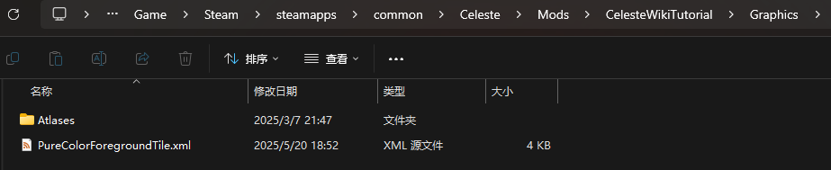

### 清理, 补充 xml

既然都是自制 ForegroundTiles.xml, 那官图相关的配置就没必要留了(你想留的话也可以), 清理一下, 然后加上自己的配置后大概长这样(记得看里面灰灰的注释)
```xml 

<Data>
    <!-- 这里是一些官图配置, 如果你不删的话 -->
    ...
    
  <Tileset id="A" path="awa">
      <!-- 我们之后在这里写规则-->
  </Tileset>
      <!-- 好像得至少写一个带 copy 的节点 Loenn 才会显示, 所以这里我们重复写一遍 -->
  <Tileset id="B" copy="A" path="awa"/>
</Data>

```

### 准备 tileset 素材

可以使用任意像素绘画软件(Aseprite, Pixel Studio, PS等)

<figure markdown>
  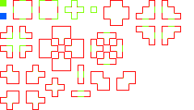{style="width: 700px; image-rendering: pixelated; title=123"}
  <figcaption>路径: Celeste\Mods\CelesteWikiTutorial\Graphics\Atlases\Gameplay\tilesets\awa.png</figcaption>
  <figcaption>可右键图像另存为</figcaption>
</figure>

<figure markdown>
  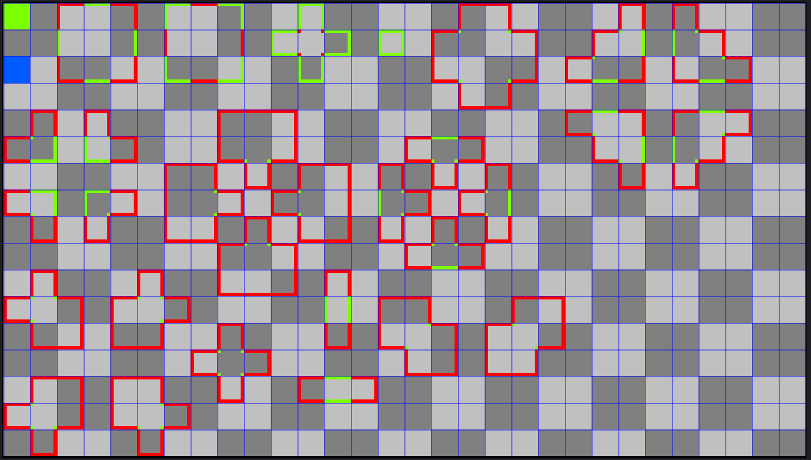{style="width: 700px; image-rendering: pixelated; title=123"}
  <figcaption>使用软件自带网格查看更加清晰</figcaption>
</figure>

### 写配置

虽然写配置在准备素材之后, 但实际操作上我们是边写配置边画的

对于一个单元, 它只会由点和线组成, 最多 4 个点, 4 条边, 最少 0 个点, 0 条边, 所以我们可以分类讨论穷举所有情况

我们用绿色/蓝色来表示规则里对应的砖, 红色只是为了方便理解对应的情况

```xml title="Celeste\Mods\CelesteWikiTutorial\Graphics\PureColorForegroundTiles.xml"
<Data>
  <Tileset id="A" path="awa">
    <!-- 0 个点, 0 条边 -->
    <!-- 绿色 -->
    <set mask="center" tiles="0,0"/>
    <!-- 蓝色 -->
    <set mask="padding" tiles="0,2"/>  

    <!-- 0 个点, 1 条边 -->
    <set mask="x0x-111-111" tiles="3,0"/>
    <set mask="111-111-x0x" tiles="3,2"/>
    <set mask="x11-011-x11" tiles="2,1"/>
    <set mask="11x-110-11x" tiles="4,1"/>

    <!-- 0 个点, 2 条边 -->
    <!-- L型 -->
    <set mask="x0x-011-x11" tiles="6,0"/>
    <set mask="x0x-110-11x" tiles="8,0"/>
    <set mask="11x-110-x0x" tiles="8,2"/>
    <set mask="x11-011-x0x" tiles="6,2"/>
    <!-- 平行 -->
    <set mask="x0x-111-x0x" tiles="12,14"/>
    <set mask="x1x-010-x1x" tiles="12,11"/>

    <!-- 0 个点, 3 条边 -->
    <set mask="x0x-010-x1x" tiles="11,0"/>
    <set mask="x0x-110-x0x" tiles="12,1"/>
    <set mask="x1x-010-x0x" tiles="11,2"/>
    <set mask="x0x-011-x0x" tiles="10,1"/>

    <!-- 0 个点, 4 条边 -->
    <set mask="x0x-010-x0x" tiles="14,1"/>

    <!-- 1 个点, 0 条边 -->
    <set mask="011-111-111" tiles="17,1"/>
    <set mask="110-111-111" tiles="18,1"/>
    <set mask="111-111-110" tiles="18,2"/>
    <set mask="111-111-011" tiles="17,2"/>

    <!-- 1 个点, 1 条边 -->
    <!-- 左上 -->
    <set mask="01x-110-11x" tiles="23,1"/>
    <set mask="011-111-x0x" tiles="22,2"/>
    <!-- 右上 -->
    <set mask="110-111-x0x" tiles="26,2"/>
    <set mask="x10-011-x11" tiles="25,1"/>
    <!-- 右下 -->
    <set mask="x11-011-x10" tiles="25,5"/>
    <set mask="x0x-111-110" tiles="26,4"/>
    <!-- 左下 -->
    <set mask="x0x-111-011" tiles="22,4"/>
    <set mask="11x-110-01x" tiles="23,5"/>

    <!-- 1 个点, 2 条边 -->
    <set mask="01x-110-x0x" tiles="1,5"/>
    <set mask="x10-011-x0x" tiles="3,5"/>
    <set mask="x0x-011-x10" tiles="3,7"/>
    <set mask="x0x-110-01x" tiles="1,7"/>

    <!-- 1 个点, 3 条边(不存在) -->
    <!-- 1 个点, 4 条边(不存在) -->
     
    <!-- 2 个点, 0 条边 -->
    <!-- 同侧 -->
    <set mask="111-111-010" tiles="9,5"/>
    <set mask="011-111-011" tiles="11,7"/>
    <set mask="010-111-111" tiles="9,9"/>
    <set mask="110-111-110" tiles="7,7"/>
    <!-- 对角 -->
    <set mask="110-111-011" tiles="15,12"/>
    <set mask="011-111-110" tiles="19,12"/>

    <!-- 2 个点, 1 条边 -->
    <set mask="x0x-111-010" tiles="16,5"/>
    <set mask="01x-110-01x" tiles="18,7"/>
    <set mask="010-111-x0x" tiles="16,9"/>
    <set mask="x10-011-x10" tiles="14,7"/>

    <!-- 2 个点, 2 条边(不存在) -->
    <!-- 2 个点, 3 条边(不存在) -->
    <!-- 2 个点, 4 条边(不存在) -->


    <!-- 3 个点, 0 条边 -->
    <set mask="010-111-011" tiles="1,11"/>
    <set mask="010-111-110" tiles="5,11"/>
    <set mask="110-111-010" tiles="5,15"/>
    <set mask="011-111-010" tiles="1,15"/>

    <!-- 3 个点, 1 条边(不存在) -->
    <!-- 3 个点, 2 条边(不存在) -->
    <!-- 3 个点, 3 条边(不存在) -->
    <!-- 3 个点, 4 条边(不存在) -->

    <!-- 4 个点, 0 条边 -->
    <set mask="010-111-010" tiles="8,13"/>

  </Tileset>

  <!-- 好像得至少写一个带 copy 的节点 Loenn 才会显示-->
  <Tileset id="B" copy="A" path="awa"/>
</Data>
```
### 在 Loenn 元数据中选择配置

记得 `ForegroundTiles.xml` 改名或者套文件夹(如果你不知道这意味着什么, 请看[这里](../mod_structure.md#everest))


然后`Ctrl + F5`刷新 Loenn, 随便涂涂画画即可

### 成果展示

理论上 Loenn 在这里只会显示绿色和蓝色的砖

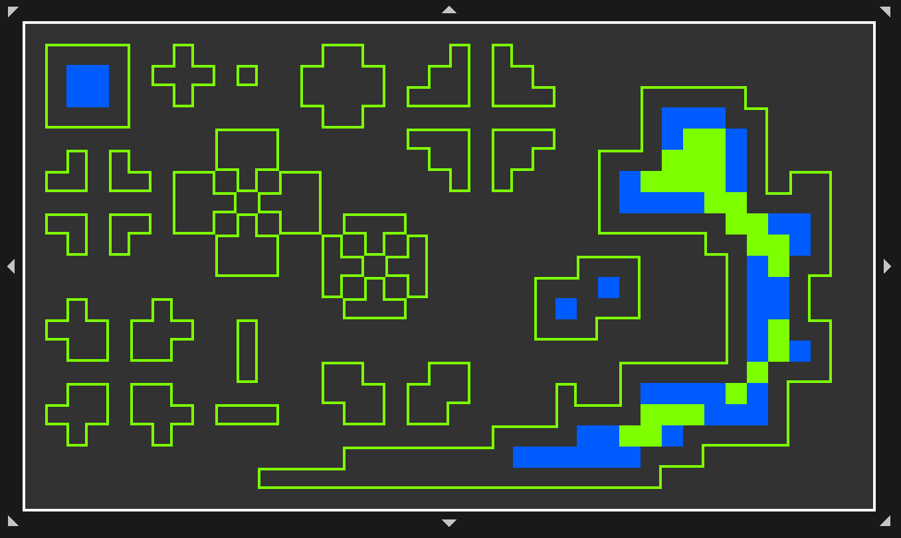

## 使用别人自定义的 `ForegroundTiles.xml`

如果你觉得你的模板更好, 欢迎投稿😋

### [`ForegroundTiles.xml` by 0x0ade](https://github.com/EverestAPI/Resources/wiki/Custom-Tilesets)

<figure markdown>
  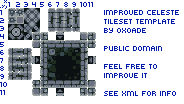{style="width: 600px; image-rendering: pixelated; title=123"}
  <figcaption>tileset 模板(若要使用, 请右键另存为)</figcaption>
</figure>

<figure markdown>
  {style="width: 800px; image-rendering: pixelated; title=123"}
  <figcaption>tileset 模板说明</figcaption>
</figure>

```xml title="ForegroundTiles.xml(未带Data标签)"
<!--
    Copy-paste this at the top of your tilesets .xml
    so that it sits next to the vanilla template (z).
    Reminder: Make sure to place the .xml into a subfolder
    and to properly set the tilesets filepath in Ahorn / Lönn.
    Also, set sound= a number from https://gist.github.com/0x0ade/2efb9532f7dc1a11daffd4dae78f07b3 
    Instead of making your custom tilesets copy z (vanilla layout),
    make them copy y (this layout) instead.
    Template image file: https://i.imgur.com/jUq838l.png
  -->
  <Tileset id="y" path="subfolder/betterTemplate">
    <!-- edges -->
    <!-- top -->
    <set mask="x0x-111-x1x" tiles="6,5; 7,5; 8,5; 9,5"/>
    <!-- bottom -->
    <set mask="x1x-111-x0x" tiles="6,10; 7,10; 8,10; 9,10"/>
    <!-- left -->
    <set mask="x1x-011-x1x" tiles="5,6; 5,7; 5,8; 5,9"/>
    <!-- right -->
    <set mask="x1x-110-x1x" tiles="10,6; 10,7; 10,8; 10,9"/>

    <!-- h pillar == -->
    <set mask="x0x-111-x0x" tiles="2,6; 2,7; 2,8; 2,9"/>
    <!-- v pillar left -->
    <set mask="x0x-011-x0x" tiles="1,6; 1,7; 1,8; 1,9"/>
    <!-- v pillar right -->
    <set mask="x0x-110-x0x" tiles="3,6; 3,7; 3,8; 3,9"/>

    <!-- v pillar || -->
    <set mask="x1x-010-x1x" tiles="6,2; 7,2; 8,2; 9,2"/>
    <!-- v pillar top -->
    <set mask="x0x-010-x1x" tiles="6,1; 7,1; 8,1; 9,1"/>
    <!-- v pillar bottom -->
    <set mask="x1x-010-x0x" tiles="6,3; 7,3; 8,3; 9,3"/>

    <!-- single tiles -->
    <set mask="x0x-010-x0x" tiles="1,1; 2,1; 1,2; 2,2"/>

    <!-- corner top left -->
    <set mask="x0x-011-x1x" tiles="4,4; 5,4; 4,5; 5,5"/>
    <!-- corner top right -->
    <set mask="x0x-110-x1x" tiles="10,4; 11,4; 10,5; 11,5"/>
    <!-- corner bottom left -->
    <set mask="x1x-011-x0x" tiles="4,10; 5,10; 4,11; 5,11"/>
    <!-- corner bottom right -->
    <set mask="x1x-110-x0x" tiles="10,10; 11,10; 10,11; 11,11"/>
    
    <!-- inside corner top left -->
    <set mask="111-111-110" tiles="1,3"/>
    <!-- inside corner bottom left -->
    <set mask="110-111-111" tiles="1,4"/>
    <!-- inside corner top right -->
    <set mask="111-111-011" tiles="2,3"/>
    <!-- inside corner bottom right -->
    <set mask="011-111-111" tiles="2,4"/>

    <!-- |== -->
    <set mask="110-111-110" tiles="11,7"/>
    <!-- _||_ -->
    <set mask="010-111-111" tiles="7,4"/>
    <!-- ==| -->
    <set mask="011-111-011" tiles="4,7"/>
    <!-- T||T -->
    <set mask="111-111-010" tiles="7,11"/>

    <!-- ???? -->
    <set mask="010-111-110" tiles="3,2"/>
    <!-- ???? -->
    <set mask="010-111-011" tiles="4,2"/>
    <!-- ???? -->
    <set mask="011-111-010" tiles="4,1"/>
    <!-- ???? -->
    <set mask="110-111-010" tiles="3,1"/>
    <!-- ???? -->
    <set mask="010-111-010" tiles="3,3"/>
    <!-- ???? -->
    <set mask="110-111-011" tiles="3,4"/>
    <!-- ???? -->
    <set mask="011-111-110" tiles="4,3"/>

    <set mask="padding" tiles="6,6; 7,6; 8,6; 9,6;  6,7; 6,8; 6,9;  9,7; 9,8; 9,9;  7,9; 8,9"/>
    <set mask="center" tiles="7,7; 8,7; 7,8; 8,8"/>
  </Tileset>
```
### [`ForegroundTiles.xml` by ...](https://github.com/EverestAPI/Resources/wiki/Custom-Tilesets)

常用在[Spooooky素材包](https://gamebanana.com/mods/474010)中, 详情见[各种Spooooky砖](https://gist.github.com/Spo0o0ky/1fb2a35efda40ab7e19e403c5328aad8)(里面会自带 xml 的)

<figure markdown>
  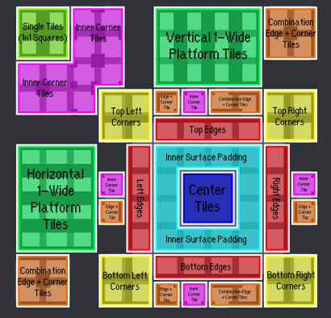{style="width: 800px; image-rendering: pixelated; title=123"}
  <figcaption>tileset 模板说明</figcaption>
</figure>

```xml title="ForegroundTiles.xml(未带Data标签)"
    <Tileset id="y" path="alternateTemplate">
        <!-- edges -->
        <!-- top -->
        <set mask="x0x-111-x1x" tiles="6,5; 7,5; 8,5; 9,5"/>
        <!-- bottom -->
        <set mask="x1x-111-x0x" tiles="6,10; 7,10; 8,10; 9,10"/>
        <!-- left -->
        <set mask="x1x-011-x1x" tiles="5,6; 5,7; 5,8; 5,9"/>
        <!-- right -->
        <set mask="x1x-110-x1x" tiles="10,6; 10,7; 10,8; 10,9"/>
    
        <!-- h pillar == -->
        <set mask="x0x-111-x0x" tiles="2,6; 2,7; 2,8; 2,9"/>
        <!-- v pillar left -->
        <set mask="x0x-011-x0x" tiles="1,6; 1,7; 1,8; 1,9"/>
        <!-- v pillar right -->
        <set mask="x0x-110-x0x" tiles="3,6; 3,7; 3,8; 3,9"/>
    
        <!-- v pillar || -->
        <set mask="x1x-010-x1x" tiles="6,2; 7,2; 8,2; 9,2"/>
        <!-- v pillar top -->
        <set mask="x0x-010-x1x" tiles="6,1; 7,1; 8,1; 9,1"/>
        <!-- v pillar bottom -->
        <set mask="x1x-010-x0x" tiles="6,3; 7,3; 8,3; 9,3"/>
    
        <!-- single tiles -->
        <set mask="x0x-010-x0x" tiles="1,1; 2,1; 1,2; 2,2"/>
    
        <!-- corner top left -->
        <set mask="x0x-011-x1x" tiles="4,4; 5,4; 4,5; 5,5"/>
        <!-- corner top right -->
        <set mask="x0x-110-x1x" tiles="10,4; 11,4; 10,5; 11,5"/>
        <!-- corner bottom left -->
        <set mask="x1x-011-x0x" tiles="4,10; 5,10; 4,11; 5,11"/>
        <!-- corner bottom right -->
        <set mask="x1x-110-x0x" tiles="10,10; 11,10; 10,11; 11,11"/>
    
        <!-- inside corner top left -->
        <set mask="111-111-110" tiles="1,3"/>
        <!-- inside corner bottom left -->
        <set mask="110-111-111" tiles="1,4"/>
        <!-- inside corner top right -->
        <set mask="111-111-011" tiles="2,3"/>
        <!-- inside corner bottom right -->
        <set mask="011-111-111" tiles="2,4"/>
    
        <!-- |== -->
        <set mask="110-111-110" tiles="11,7"/>
        <!-- _||_ -->
        <set mask="010-111-111" tiles="7,4"/>
        <!-- ==| -->
        <set mask="011-111-011" tiles="4,7"/>
        <!-- T||T -->
        <set mask="111-111-010" tiles="7,11"/>
    
        <!-- ???? -->
        <set mask="010-111-110" tiles="3,2"/>
        <!-- ???? -->
        <set mask="010-111-011" tiles="4,2"/>
        <!-- ???? -->
        <set mask="011-111-010" tiles="4,1"/>
        <!-- ???? -->
        <set mask="110-111-010" tiles="3,1"/>
        <!-- ???? -->
        <set mask="010-111-010" tiles="3,3"/>
        <!-- ???? -->
        <set mask="110-111-011" tiles="3,4"/>
        <!-- ???? -->
        <set mask="011-111-110" tiles="4,3"/>
    
        <!-- ???? -->
        <set mask="x0x-111-011" tiles="2,10"/>
        <!-- ???? -->
        <set mask="x0x-111-110" tiles="1,10"/>
        <!-- ???? -->
        <set mask="011-111-x0x" tiles="2,11"/>
        <!-- ???? -->
        <set mask="110-111-x0x" tiles="1,11"/>
        <!-- ???? -->
        <set mask="x11-011-x10" tiles="10,1"/>
        <!-- ???? -->
        <set mask="11x-110-01x" tiles="11,1"/>
        <!-- ???? -->
        <set mask="x10-011-x11" tiles="10,2"/>
        <!-- ???? -->
        <set mask="01x-110-11x" tiles="11,2"/>
    
        <!-- ???? -->
        <set mask="x0x-111-010" tiles="8,11"/>
        <!-- ???? -->
        <set mask="010-111-x0x" tiles="8,4"/>
        <!-- ???? -->
        <set mask="01x-110-01x" tiles="4,8"/>
        <!-- ???? -->
        <set mask="x10-011-x10" tiles="11,8"/>
    
        <!-- ???? -->
        <set mask="x0x-011-x10" tiles="6,4"/>
        <!-- ???? -->
        <set mask="x0x-110-01x" tiles="9,4"/>
        <!-- ???? -->
        <set mask="x10-011-x0x" tiles="6,11"/>
        <!-- ???? -->
        <set mask="01x-110-x0x" tiles="9,11"/>
    
        <set mask="padding" tiles="6,6; 7,6; 8,6; 9,6;  6,7; 6,8; 6,9;  9,7; 9,8; 9,9;  7,9; 8,9"/>
        <set mask="center" tiles="7,7; 8,7; 7,8; 8,8"/>
    </Tileset>
```

## 自定义 AnimatedTiles.xml

为了完整性这里再提一嘴 `AnimatedTiles.xml`

我们可以使用它来为每种砖的样式附加上可偏移的动画, 操作与 `ForegroundTiles.xml` 类似

这里我们直接借用原版自带的 grass 动画也就是 `Celeste/Graphics/Atlases/Gameplay/animatedTiles/grass/top_a`

```xml title="Celeste\Mods\CelesteWikiTutorial\Graphics\PureColorAnimatedTiles.xml"
<Data>
    <!--  delay: 一帧动画持续多少秒  -->
    <!--  posX/Y: 相对于砖的 xy 偏移, 比如这里 y 刚好向上偏移了一个砖的长度, 草就长到了砖上  -->
    <!--  origX/Y: 就是动画的锚点, 或者说中心在哪儿, 比如一张图片放在某个位置, 光有坐标还不够, 还得有图片的中心, 也就是图片的哪个点该放在那个位置  -->
	<sprite name="awa_top_a" path="animatedTiles/grass/top_a" delay="0.2" posX="0" posY="-8" origX="4" origY="4"/>
</Data>
```

然后我们在 ForegroundTiles.xml 给想生草的砖加个 `sprites` 属性即可, 名字就填 `awa_top_a`

```xml title="Celeste\Mods\CelesteWikiTutorial\Graphics\PureColorForegroundTiles.xml"

<Data>
  <Tileset id="A" path="awa">
    ...

    <!-- 0 个点, 1 条边 -->
    <set mask="x0x-111-111" tiles="3,0" sprites="awa_top_a"/>
    <set mask="111-111-x0x" tiles="3,2"/>
    <set mask="x11-011-x11" tiles="2,1"/>
    <set mask="11x-110-11x" tiles="4,1"/>

    ...

  </Tileset>

  <!-- 好像得至少写一个带 copy 的节点 Loenn 才会显示-->
  <Tileset id="B" copy="A" path="awa"/>
</Data>
```

别忘了在 Loenn 元数据里选择 `AnimatedTiles.xml`

然后你就能看到生草的砖了😋
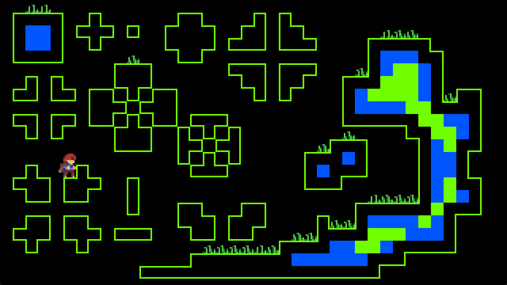
