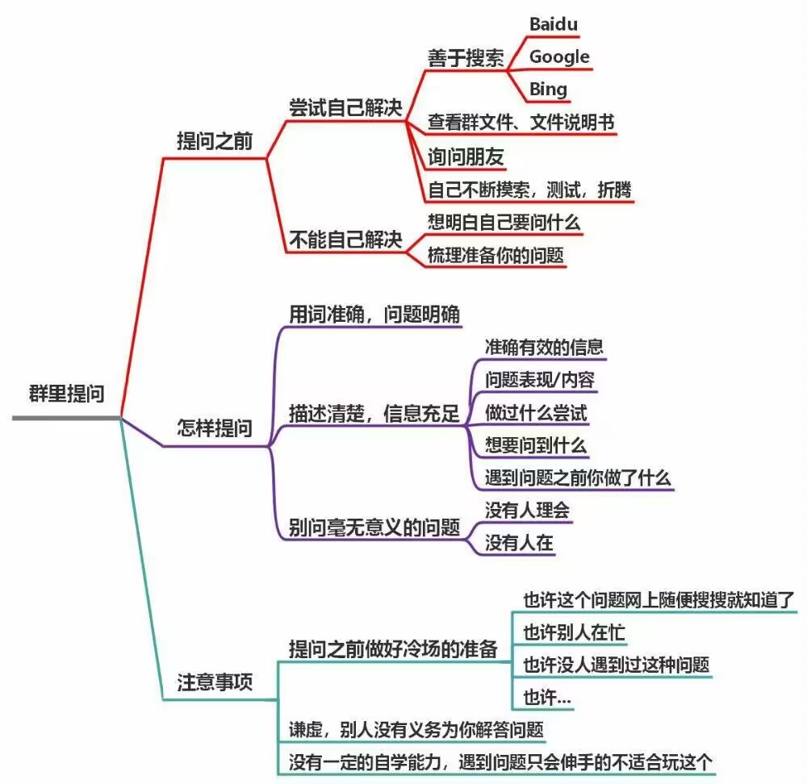

其他资料

* [提问的智慧](https://github.com/ryanhanwu/How-To-Ask-Questions-The-Smart-Way/blob/main/README-zh_CN.md)

## 省流

提问者一定要会提问✍✍✍✍✍✍

## [提问](https://github.com/ryanhanwu/How-To-Ask-Questions-The-Smart-Way/blob/main/README-zh_CN.md#%E5%A3%B0%E6%98%8E)

当你能清晰的描述自己的问题的时候, 这往往意味着你对这个问题有了较为清楚的认识, 不仅方便别人后续的回答, 更多的情况是自己在准备提问资料的过程中理清了思绪顺便就把问题解决了

那么如何提问呢, 只需要如下要素就会有大佬来帮你了🥰

### 提问前

* 努力的证明: 先动手再问, 不做伸手党(不要觉得你跟大佬一问一答和谐友爱, 在旁人看来纯纯伸手党, 因为教程里全写了😡)

### 提问时
* 详细的信息: 别惜字如金, 能提供越多清晰详细信息越好
    * 口头描述: 不管是需求还是游戏崩了都请描述清晰点
    * 录个视频
    * 截图(很多时候发文件比发截图还有用, 尤其是对截图截一半的人来说😡, 虽然大概率是因为自己也不知道哪块信息重要点)
        * 用 [QQ](https://im.qq.com/index/) 截屏
        * `Shift + Win 徽标键 + S`截屏
        * 下载 [Snipaste](https://zh.snipaste.com/) 这个软件
    * [log.txt](../mods/game_crashes.md): 存放了游戏的调试信息, 方便在游戏崩溃时向群友求助, 但你还是需要做相应的描述, 请看[VCR](#_8) 
* 谦卑的语气: 请问...你好...
* 耐心的等待: 不是所有人都会吃饱没事干去爬几百层的楼的, 所以能解决你问题的人不一定能看到, 看到也不一定有空回, 有空也不一定想要回, 因为可能你问的不清楚, 一两句话也回答不清楚, 所以请尝试等待, 甚至多问几次(问的又随便, 发现没人回然后又在背后蛐蛐别人还有人类吗😡)
* 认真倾听: 个人建议你在问出这个问题后**把qq的勿扰模式关了**(并不是所有人都有@的习惯的), 不然你每次回应的 cd 超过 10min 可能不太好, 真有事也提前说出来, 又不是什么不能说的事(想象一下你上一秒还在跟别人聊的火热朝天, 然后别人突然消失了, 怎么喊都喊不回来, 若干小时后来突然来一句, "刚才去吃饭了/洗澡去了/...", 我想你的表情应该是😅)
* 给予反馈: 就算是帮不上忙的建议, 最好也回应例如“好像什么都没发生耶”, “报错了, 上面说...”之类的 (不然别人根本不知道你是没看到消息, 还是没解决问题, 又或是懒得理他,
  甚至是问题解决了都没个信儿的)
* 将心比心: 问问自己"如果我是大佬那么这个人提的问题值得我解答吗还是说得不断追问最后发现是别人自己🐷了结果别人也没学到东西自己也浪费了时间"

### 提问后

* 复盘: 如果你解决了问题, 还请告诉大家问题出在哪儿了, 这不仅降低了其他人踩坑的几率, 也满足了大家的好奇心, 如果没解决问题, 也可以留下一句类似 `还是没整明白, 我再研究下` 的话, 这样别人好歹知道这个问题进行到什么程度了, 对你也会留下一个好的印象


{ width="600" }
{ width="600" }

### [小剧场](https://github.com/ryanhanwu/How-To-Ask-Questions-The-Smart-Way/blob/main/README-zh_CN.md#%E4%B8%8D%E8%AF%A5%E9%97%AE%E7%9A%84%E9%97%AE%E9%A2%98)

<details>
<summary>碎碎念(别看)</summary>
<p>我发现回答别人问题也是一种 wordle, 只是有时候别人回复的太慢导致游戏体验很差</p>
<p>牛逼, 孩子, 牛逼, 你是这个👍</p>
<p>其实你怎么样都无所谓, 但是能不能给点反馈, 不然我会很心碎, 帮不帮都不是滋味</p>
<p>哥们我很想帮你的, 奈何你问问题的方式真的有点不太像人, 本身大家就都不容易, 既然你不体谅我我也不体谅你了</p>
<p>虽然我承认存在不知道自己不知道的阶段, 但是不妨碍你问的问题真的一点也不用心</p>
<p>问问题真的很难吗🤔, 不就是把你遇到的问题/想做的事说清楚点, 然后等着别人回复, 之后别人需要啥信息自己补充不就很快解决了, 最后感谢一下不就完事了?</p>
<p>为什么经常有人用糟糕的提问方式在群里花了好几天去问一个很简单的问题啊😑, 难道你真的不知道不是大家不想帮你, 而是你问问题的方式真的太臭了吗😡</p>
</details>

<p style="font-size: 50px">写爽了😋, <b>气~笑~</b>了😡🥰, 力竭了😣😣😣</p>


#### 若隐若现型

```
A: 😭我蔚蓝又崩了😭
...没人理他
...20min后
A: 我蔚蓝崩了, 该怎么办啊😭
                                                                               看看log.txt :B
...10min后
A: 神么是log.txt🤔
                                                 看报错信息的一个文件, 在蔚蓝根目录下你找找 :C
...11min后
A: 蔚蓝根目录在哪儿😰
...1min后
                                从你的Steam文件夹开始往下找, Steam\steamapps\common\Celeste :B
...9min后
A: 这样吗(接着发了一个log.txt内容的手机拍屏, 并未拍到关键信息)🥰
...2min后
                                                               ...你直接把log.txt发群里就行 :B
...12min后
A: (复制粘贴了log.txt里的所有内容并发在了群里)😎
...3min后
                                          (😰)看起来像是xxxHelper出问题了, 可以先禁用下试试 :D
...8min后
A: 怎...怎么禁用😰
...4min后
                                  游戏内禁用, 使用Olympus或者Celemod禁用(叽里呱啦讲了一大堆) :C
...6min后
A: 成功了大佬, 但是这样图就进不去了怎么办(😰
...5min后
                                                          嘶...要不你把他们更新到最新版试试? :B
...5min后
A: 怎么更新不了啊, 以前都能更新的怎么回事😭
...6min后
                                             你ChinaMirror Mod开了么, 不用镜像国内不方便更新 :B
...3min后
A: 成功了, 感谢 大佬
...8min后
                                                                             嗯嗯, 不客气...:B
```

兄弟你还在吗, 能不能尊重一下我😭

---

#### 惜字如金型

```
A: log.txt
                                               看起来像是xxxHelper出问题了, 可以先禁用下试试 :B
...
```

话疏了嗷, log 是很牛逼, 但是你别连话都不会说了, 报错前在干嘛, 可能是什么操作导致的报错能不能顺便提一嘴😡

```
A: 这是怎么回事(发两张图片让你找不同)?
...
```

除非问题很典, 不然完全分析不出为什么, 更变态的是可能根本看不出哪里奇怪

```
A: 这是怎么回事(发一张图片让你看奇怪的地方)?
...
```

完全看不懂你觉得哪里有问题, 而且找出不同了也不知道哪张对你来说是错误/正确的情况

> 我说你刚才干了什么, 加了什么东西自己不知道吗😡

```
A: xxx 怎么没效果?
...
```

更完全不知道你干了什么

```
A: xxx 到底怎么做啊!
...
```

完全不知道你是在发泄情绪还是在提问

```
A: xxx(一个很泛的概念) 怎么做, 有人教教吗
...
```

所以到底哪里不会😑

```
A: xx 地图里的 xx 怎么实现的, 有人教教吗
...

```

恭喜你啊, 原本只需要一个知道实现方式且愿意回答你的人就行了, 现在得需要一个知道实现方式且愿意回答且玩过这张图且知道你指的是什么的人来回答你了

```
A: 有人懂制图吗? 有人懂画画吗? 有人懂 xxx 吗?
...
```
有问题直接问, 你问别人懂不懂有屁用啊! 难道你还指望别人跟哄宝宝一样先回复你 "我懂这方面呀, 你遇到什么问题了吗" 吗?

既然人家懂的话还需要先跟你说声懂再去解决问题吗, 你不觉得这样很费劲吗?

更别提你这样问问题本身就把对方架在高位, 万一你问的问题人家不懂哪儿有台阶给人家下啊😡

---

#### 自问自答型

```
A: log.txt
A: 我刚才进房间的时候崩了怎么办啊
A: 哦, 实体属性填错了

...

A: log.txt
A: 我刚才进房间的时候崩了怎么办啊
A: 哦, 重启下好了

...

A: log.txt
A: 我刚才进房间的时候崩了怎么办啊
A: 哦, 更新了下 helper 又能用了
```

虽然有点搞, 但是做的好

---

#### 答非所问型

懒得举例了, 力竭了

---

#### 自作聪明型

```
A: xxxx (简单的地描述了问题)
                                                                 能看下 xxx 吗 :B
... 12 min 后
A: 我觉得是不是 xxx 的问题, 试了下 xxx 好像没解决
                                                                 能看下 xxx 吗 :B
(反复折腾好几个回合) 30 min ...
A: xxx
(10s 后)
                                                                 (指出问题) :B
A: 原来是这样, 谢谢!
``` 

---

#### 注意隐私型

```
A: 请问我这路径填的有问题吗(附上一张实体属性截图和素材截图, 但是素材截图没有截路径)
...
```   

一般除了个别文件夹可能要马赛克糊一下, 大部分时候不用吝啬你的截图

---

#### 准备充分型

```
A: xxxx (详细地描述了问题, 但不完全详细)
                                                                 那素材路径是怎样的呢 :B
... 6 min 后
A: 我在录视频
``` 

对于这类我的建议是先把要问的都发到自己 QQ 上, 之后再合并转发到群里, 不仅可以防止问题被聊天消息打断, 也能让想回答的人一下获取全部信息, 除非就是一些文字说明加几张图, 那直接发没事

---

#### 埋头捣鼓型

```
A: xxxx (详细地描述了问题)
                                                                 更新下 Everest 试试 :B
... 12 min 后
A: 好像不行
                                                            那更新下 xxx Helper 试试 :C
... 15 min 后
A: 可以了欸, 谢谢
``` 

对于这类我的建议是给予反馈, 比如可以回复类似`好的` `我试试` `等下, 我试下` 之类的话

---

#### 神秘色彩型

```
A: xxxx 怎么做
                                                                 好奇怪的需求, 你要干啥 :B
A: 不好意思不能说, 所以有没有解决方案, 没有的话就算了...
``` 

除非有保密需求, 否则大部分情况这种都是 XY 问题, 也就是你在尝试解决 X 问题, 但是你觉得解决了 Y 就能解决 X, 于是你向群友询问 Y 怎么解决, 群友觉得你不明所以, 最后发现其实用 Z 方法就能解决 X 问题了

---

#### 爱搭不理型

```
A: xxxx 怎么做
                                                                 (方案 1) :B
                                                                 (方案 2) :C
                                                                 (方案 3) :D
A: B, 你这个方法好像不可以欸, 还有别的方法吗 ...
...(没有后话了)...
``` 

有的孩子真的注意力一被吸引就啥都看不见了(

---

#### 时空回溯型

```
A: xxxx 怎么报错了
                                                                 你把 xxx 关了就好了 :B
A: 好的, 谢谢

... 5h 后

A: xxxx 怎么报错了
                                              你把 xxx 关了就好了(其实内心已经弘文了) :B
A: 好的, 谢谢
```

我能在拥有健忘症的情况下做出一张图吗

#### 时空回溯型

```
A: xxxx 怎么报错了
                                                                 你把 xxx 关了就好了 :B
A: 好的, 谢谢

... 5h 后

A: xxxx 怎么报错了
                                              你把 xxx 关了就好了(其实内心已经弘文了) :B
A: 好的, 谢谢
```

我能在拥有健忘症的情况下做出一张图吗

---

#### 目中无人型

```
A: xxxx 怎么报错了

...(若干聊天记录)
...(若干聊天记录)
...(xx 小时后)
                                                            @A, 你把 xxx 关了就好了 :B
...(若干聊天记录)
...(若干聊天记录)
...(若干聊天记录)
...(xx 小时后)

A: 好像还是不行
```

不是戈门, 你也太松弛了, 你不 @ 别人, 难道你指望人家一直待群里等着你回消息吗, 
而且路过的想帮你的人根本看不到上下文, 完全听不懂你在说什么, 难道你指望人家查查聊天记录看你说了什么然后再回复你?

---

#### 没手没脚型

```
A: 单向板可以粘在红绿灯上吗
```

每次看到这种问题我都有点力竭, 给人的感觉不亚于在询问

```
A: 请问用手掌拍手的时候会发出声音吗?
                                                              你为什么不自己试一下呢 :B
A: 我的室友在睡觉, 不方便, 顺便问下 xxx 的英文名字叫什么?
                                                              你为什么不自己搜一下呢 :B
```

如果你只是好奇, 并且在跟别人闲聊, 脑子里突然蹦出一个想法, 希望得到解答,
那么你的问题应该表现得更加自然, 而不是像提问一样, 像下面这个例子一般就没什么问题(至少观感上好很多)

```
(上文聊了一些相关的东西)
A: 欸, 那这么说的话是不是单向板也可以粘在红绿灯上呀
```

如果你尝试过了, 发现好像粘不上去, 你很困惑, 你觉得应该是能粘上去的, 于是向大伙儿寻求帮助,
那你也至少应该把自己做过什么写出来, 像这样

```
A: 请问单向板能粘在红绿灯上吗, 我把单向板放在红绿灯旁边, 但是红绿灯移动的时候单向板不跟着走(并附上截图/视频)
```

这样的话大家会觉得你至少努力过了, 而且看起来确实遇到了问题, 而且看到你提供了清晰的描述自然愿意帮助你解决这个问题

---

#### 聪明懒惰型

```
A: 为什么我的游戏出现了奇怪的 bug, ...描述问题...(并附上自己开启的 100 多个 helper)
```

虽然你确实做到了提供详细的信息, 但还是建议你将问题的范围缩的尽可能小, 比如像下面这样

> 如果你懒得缩小问题, 那我也懒得回答你, 就这么简单

```
A: 我的游戏出现了奇怪的 bug(并作简单描述), 当同时开启 A Helper 和 B Helper 并放置 xxx 实体的时候这个 bug 就会发生
A: 单开 A 或者 B 都不会触发这个 Bug, 而且必须放置 xxx 才能复现, 好奇怪啊, 有大佬懂这是为什么吗
```

---

#### 全球广播型

```
(A 群)
A: 为什么我的游戏出现了奇怪的 bug 啊 (...描述问题...)
(B 群)
A: 为什么我的游戏出现了奇怪的 bug 啊 (...描述问题...)
(C 群)
A: 为什么我的游戏出现了奇怪的 bug 啊 (...描述问题...)
(D 群)
A: 为什么我的游戏出现了奇怪的 bug 啊 (...描述问题...)
(E 群)
A: 为什么我的游戏出现了奇怪的 bug 啊 (...描述问题...)
(F 群)
A: 为什么我的游戏出现了奇怪的 bug 啊 (...描述问题...)
```

虽然我知道你很急, 但是广播问题并不能很好的解决问题, 如果这个问题需要一定步骤才能解决,

* 你能保证同时跟多个人对线吗, 你能及时回复吗
* 你能保证在问题解决甚至没解决后留下一句声明来收拾你在群里留下的烂摊子吗
* 有没有可能这些群里人都差不多, 你还不如找一个靠谱的群发一次

在各个群里 "大喊大叫" 观感真的不是很好

---

#### 理所当然型

```
A: xxxx 怎么做
                                                                 (方案) :B
A: yyyy 怎么做
                                                                 (方案) :C
A: zzzz 怎么做
                                                                 (方案) :D
```

请你在得到帮助后至少说一声谢谢🫡

### 总结

总之提问的本质就是把对方当人看, 并且尽可能地减小信息差, 让别人带入你的视角重现你的问题

请你把自己放在低位, 让别人能舒舒服服的回答你的问题好吗?

* 你知道自己什么操作系统, 人家可不知道
* 你知道自己电脑什么配置, 人家可不知道
* 你知道自己刚入门什么都不会, 人家可不知道
* 你知道自己遇到问题的时候干了什么, 人家可不知道
* 你知道自己在着手解决问题了, 人家可不知道
* 你知道自己努力过了, 人家可不知道
* 你知道自己的问题很重要, 人家可不知道
* 你知道自己笨手笨脚的做事节奏比较慢, 人家可不知道
* 你觉得别人应该帮助萌新, 人家觉得凭什么
* 你觉得自己刚入门就遭受到恶意/冷漠, 但人家可能已经招待过 10000 个萌新了
* 你觉得自己想什么时候回消息是你的自由, 那人家选择不回答你的问题也是他的自由
* 你觉得自己语文很好, 口述就能描述问题, 人家可能觉得你在满嘴放屁
* 你觉得说话没必要客套, 应该专注于问题本身, 但人家可能就是一个敏感的人
* 你觉得自己的问题可以由不同的人分批回答, 但人家完全有能力直接回答, 但是被你冷落
* 你在提问的过程中抖机灵, 觉得很有趣, 但人家觉得没意思
* 你觉得人家很严肃, 人家觉得你很幼稚
* 你说话就这个风格, 但人家就是不喜欢
* 你觉得没人懂你, 但是你没想过你要是别人能不能懂自己


## [回答](https://github.com/ryanhanwu/How-To-Ask-Questions-The-Smart-Way/blob/main/README-zh_CN.md#%E5%A6%82%E4%BD%95%E6%9B%B4%E5%A5%BD%E5%9C%B0%E5%9B%9E%E7%AD%94%E9%97%AE%E9%A2%98)

作为回答问题的人我们也有一些建议

* 和善的态度: 提问的人可能已经被问题折磨很久了, 这可能导致他的语气中充满绝望和愤怒, 进而显得无礼和愚蠢, 相信大家都有这种被神必问题折磨的经历
* 宽容: 你可能觉得这个人未免太蠢了, 怎么这么多问题, 但事实上他可能才刚刚接触电脑(进入一个新的领域), 连键盘都还没摸熟
* 别装逼: 不懂的地方就说出来, 别聊了半天一点问题没解决, 帮助别人已经难能可贵, 诚实的表示自己不知道一点也不丢人
* 别抖机灵: 人家相信你才跟着你的步骤做的, 结果你把人家带歪了, 到时候把什么东西搞坏了你赔不赔?
* 学会追问: 尽管一个人可能很会提问, 但他仍可能无法提供完整的信息, 因为他不知道自己不知道, 所以也不知道这个问题缺什么, 所以在这方面我们可以稍加提点
* 意识到别人可能不知道自己不知道: 你可能觉得群公告里已经放了教程链接了, 但就是有种种情况导致别人没有看到, 所以有时候甩个链接也总比揣测别人是不是懒狗要好
* 要帮就好好帮: 提供你认知中相对好的解法, 而不是一些蒙混过关容易露馅的技巧
* 正面回答问题: 如果别人已经看过 ABCDEFG 教程还是没搞懂, 结果你仍然甩了一个前面教程的链接, 那完全没用(当然前提是提问者真的认真看过教程了😡)
* 不做重复的工作: 如果经常碰到类似问题, 想想办法有没有什么渠道可以整理一份 FAQ 之类的问答表方便初次查询
* 展示心路历程: 如果你在经历一场酣畅淋漓的研究后解决了某个人的提问, 你可以附上研究过程而不是直接给出结果, 尽管别人可能看不懂, 但是不妨碍授人以鱼不如授人以渔


## 自学

善于搜索, 提问和捣鼓就是自学的本质

学校的老师教会了我们不懂就要问, 但是你是否想过你可以向电脑, 向搜索引擎, 向 AI 提问呢, 你要意识到问题是可以靠自己解决的, 而且解决问题带来的爽感不亚于实现功能, 所以你要有自学的意识,
只有当这个问题的难度真的超过了你所能处理的极限和搜索引擎的极限或是所需的时间精力成本过大, 这个时候才需要向群友提问

* 建议使用正常的浏览器(比如 [Edge](https://www.microsoft.com/zh-cn/edge/download)), 正常的搜索引擎(比如 [bing](https://cn.bing.com)), 正常的搜索工具(比如 [DeepSeek](https://chat.deepseek.com/), [ChatGPT](https://chatgpt.com/) 这类 AI), 如果你还在使用[360安全浏览器](https://browser.360.cn/)在[百度](https://www.baidu.com)搜索, 向各种来路不明的 AI 提问, 那我只能说ごたこう多幸をいのり祈ります
* 建议善用`Ctrl + F`搜索和网页上方的全局搜索: 帮你快速在网页/文件中定位想要的内容
* 建议善用翻译软件(比如[有道翻译](https://fanyi.youdao.com/download-Windows)), 遇到不会的单词时第一反应应该是查而不是问

### "翻墙"

你要知道我们在中国是访问不了国外的一些网站的, 比如`Google`, `Youtube`, `Twitter`, `Reddit`, `Discord` 等等等等, 为什么呢, 你说中国人这么多傻逼也不少要是能随意和外国通信搞黄赌毒间谍对立歧视啥的那中国不炸了吗😡,
所以就立了一道墙,阻隔了双方的通信,
但是 ... 流淌在我们血液里的 ... 只有对知识的渴求🖐️😭🤚, 所以你还翻不翻? 你死都得翻😡, 但在此之前你需要了解一些基本的网络知识

* [【硬核科普】IP地址是什么东西？IPV6和IPV4有什么区别？公网IP和私有IP又是什么？](https://www.bilibili.com/video/BV1DD4y127r4/)
* [【硬核科普】能上QQ但是打不开网页？详解DNS服务，DNS解析，DNS劫持和污染](https://www.bilibili.com/video/BV1Rp4y1a7xQ)

然后就可以大致了解翻墙的[原理](https://iamwsll.cn/article/45)

不过像 `Github` 这种的属于半墙不墙, 偶尔裸连能上, 主要是因为 DNS 污染等问题, 用一些简单的工具就能搞定, 比如 `FastGithub`, `Steam++`, `steamcommunity 302` 等等

至于怎么真翻, 原理大概就是找个能访问的国外代理服务器, 它帮你访问你���Ҫ�¨2�ѧϰ��来无法访问的网站, 然后把数据���给你, 所以当你�����发现要钱的时候也别觉得太坑���, 毕竟性质跟中国电信/移动差不多, 不过需求不大可以���买按流量计费的���, 接下来推荐几个好�的���Ҫ�¨比如2�ѧϰ��适合¨2�ѧϰ��ϰ��适合���ϰ���ϰ��, 就只能说这么多了(希望别被和谐  
